# ```circularMT``` user guide

### Contents
- ```circularMT``` user guide  
  - [Introduction](#introduction)  
    - [Circular or linear maps](#circular-or-linear-maps)
      - [File formats](#file-formats) 
      -  [```circularMT's``` interface](#circularmts-interface)
  - [Entering data](#entering-data)
  - [Circular display](#circular-display)  
  - [Linear display](#linear-display)  
  - [Both displays](#both-displays)  
  - [Selecting which features to display](#selecting-which-features-to-display)  
  - [Changing the order and/or the strands of the sequences](#changing-the-order-andor-the-strands-of-the-sequences)    
  - [Adjusting the start point of the genome's annotation](#adjusting-the-start-point-of-the-genomes-annotation)   
  - [Changing the feature's name to an alternative name in the data file](#changing-the-features-name-to-an-alternative-name-in-the-data-file)  
  - [Changing the displayed length of the genome](#changing-the-displayed-length-of-the-genome)  
  - [Changing the genome's name](#changing-the-genomes-name)
  - [Drawing smaller features last](#drawing-smaller-features-last)  
  - [Changing the colour of one or more features](#changing-the-colour-of-one-or-more-features)  
  - [Changing the font colour of one or more features](#changing-the-font-colour-of-one-or-more-features)   
  - [Copying the colour scheme from one feature to another](#copying-the-colour-scheme-from-one-feature-to-another)
  - [Manually editing a feature's name](#manually-editing-a-features-name)  
  - [Manually moving text written next to a feature](#manually-moving-text-written-next-to-a-feature)   
    - [Resizing the image](#resizing-the-image)  
    - [Changing the ```Cluster size``` value](#changing-the-cluster-size-value)   
    - [Rotating and changing the X and Y coordinates of a features name](#rotating-and-changing-the-x-and-y-coordinates-of-a-features-name)
  - [Adding a feature](#adding-a-feature)  
  - [Removing a feature](#removing-a-feature)  
  - [Moving the genome's center point](#moving-the-genomes-center-point)  
  - [Saving the image to a 300 dpi image](#saving-the-image-to-a-300-dpi-image)    


# Introduction

## Circular or linear maps

```circularMT``` was created to display the organisation of circular mitochondrial genomes, principally from metazoan eukaryotes. While these genomes are circular it is possible to display them as either circular or linear maps by checking or unchecking the ```Draw as linear map``` option at the top right corner of the user interface (see blue box in Figure 1). Irrespective of whether the map is circular or linear, all the options have the same basic effect, consequently this guide will describe the production of a circular map and note any difference between a controls behaviour with linear or circular maps were appropriate. 

### File formats 
```circularMT``` is able to read a range of file formats such as Genbank, mitos, seq, bed, fasta, gtf and gff files. A description of the required formatting of each of these files can be found [here](FileFormats.md).

### ```circularMT's``` interface

```circularMT``` consists of a ```Genome``` panel located on the left in which the genome is displayed and an ```Options``` panel to the right that contains all the controls that allow you to modify the display. On start up the drawing area consists of just a black circle (Figure 1). The only control in the ```Genome``` panel is the ```Draw as linear map``` (blue box in Figure 1) check box which toggles the map between a circular diagram or a linear map.


Figure 1: Checking the ```Draw as linear map``` option (blue box) changes the display to a linear map. Data is imported by pressing the ```Select``` button (red box).
<hr />

## Entering data

To import a file, press the ```Select``` button at the top of the ```Options``` panel and select a file (red box in Figure 1). Since a large number of file formats do not explicitly contain the length of the genome, before processing the file ```circularMT``` may prompt you for the length of the sequence (Figure 2). If prompted, enter the genome's length and press ```OK```. If you had previously worked on a file in the same session, it's length may be displayed in the ```Genome length``` form.


Figure 2
<hr />

 In Figure 3 the human mitochondrial genome Genbank file was selected [(download)](../Example%20data/sequence.gb) resulting in its name appearing in the program's title bar. If the ```Draw as linear map``` is not checked the genome will be drawn as a circle (Figure 3 a) , if it is checked the display will be linear (Figure 3 b). 


Figure 3 a: If the ```Draw as linear map``` is not checked (blue box) the genome is drawn as a circle


Figure 3 b: If the ```Draw as linear map``` is checked (blue box) the genome is drawn as a linear line
<hr />

### Circular display

The circular map displays all the features found in the file as a series of arrows flanking the black circle which represents the genome. The start of the sequence (1 bp) is at 12 o' clock and is draw clockwise from there. Each 1 kb interval is marked by a line cutting the circle. The features on the outside of the circle are on the forward strand, while those on the inside are on the reverse strand. Initially, all the features in the file are draw unless the feature is either 1 bp long or longer than 1/3 of the genome's length.  

If there is room the name of the feature is displayed in the arrow, otherwise it is written at 90 degrees to the feature. However, if the feature is on the inside of the circle and its name is particularly long the name will be written outside the circle.  

### Linear display

The linear map displays all the features found in the file as a series of arrows above or below a black line which represents the genome. The start of the sequence (1 bp) is on the left, with each kilobase interval  marked by a short vertical line. The features above the line are on the forward strand, while those below the line are on the reverse strand. Initially, all the features in the file are draw unless the feature is either 1 bp long or longer than 1/3 of the genome's length.  

If there is room, the name of the feature is displayed in the arrow, otherwise it is written at 90 degrees to the feature. 

### Both displays
Features are draw even if one feature obscures another, this is especially obvious for the tRNAs genes. Since there is not enough room to write the tRNA's name in the arrow, it's draw next to it. If a number of tRNAs occur in tandem, the location of their names are adjusted to prevent them over-writing each other. However, the clusters of tRNA at about 6.7 Kb and 13.2 Kb contain multiple tRNAs, each duplicated in the ___tRNA___ and ___gene___ feature set, and due to the number of features ```circularMT``` as issues writing the names. This can be resolved by selecting which features to draw as described below.

## Selecting which features to display

Just below the ```Select``` button used to pick the data file, is a check box list control that lists all the different types of features found in the file (see blue box in Figure 4). In this case they are ***source***, ***D-loop***, ***gene***, ***tRNA***, ***rRNA***, ***misc-feature*** and ***CDS***. The names of the features and what they contain depends on the data file: another file may have a completely difference list of features. If all the features are unchecked, no features will be shown in the display area (Figure 4). Figures 4 to 11 shows the effect of unchecking all the options and then checking each one in turn.


Figure 4: No features selected
<hr />


Figure 5: The ***source*** feature is selected; in this case this feature represents the whole genome and because it is longer than 1/3 of the genome's length it is not drawn.
<hr />


Figure 6: The ***D-loop*** feature(s) are selected. In this file, this feature set contains only one D-loops.
<hr />


Figure 7: The ***gene*** features are selected: this feature type includes the protein coding genes, rRNAs and tRNAs.
<hr />

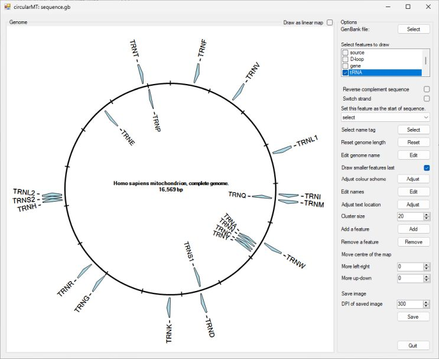

Figure 8: The ***tRNA*** features are drawn. This feature only contains tRNAs.
<hr />


Figure 9: The ***rRNA*** features are drawn. This feature only contains rRNAs.
<hr />


Figure 10: The ***misc_features*** are drawn: In this file the misc_features are 1 bp long and so are not drawn.
<hr />


Figure 11: The ***CDS*** features are drawn: This feature only contains protein coding sequences.
<hr />

As can be seen from the preceding figures there may be a number of ways to display the individual sequences you are interested in. What options you select is very dependant on the how the data file is arranged and your needs. Generally speaking, to easily produce a nice image its best to select feature sets that only contain one type of feature, in this case the ***D-loop***, ***tRNA***, ***rRNA*** and ***CDS*** options were selected to create Figure 12.


Figure 12: The ***D-loop***, ***tRNA***, ***rRNA*** and ***CDS*** were selected such that each feature was drawn once.

<hr />

## Changing the order and/or the strands of the sequences

When working with a de novo assembled genome the contig may not be in the preferred orientation, or the annotated sequences are on the wrong strand. These issues can be resolved by checking one or both of the ```Reverse complement sequence``` or ```Switch strand``` options below the check box list options (see blue box in Figure 13). Figures 13, 14 and 15 show the affect of selecting these options.


Figure 13: Checking the ```Reverse complement sequence``` option switches the feature's strand and draws the sequences in the reverse order.

<hr />

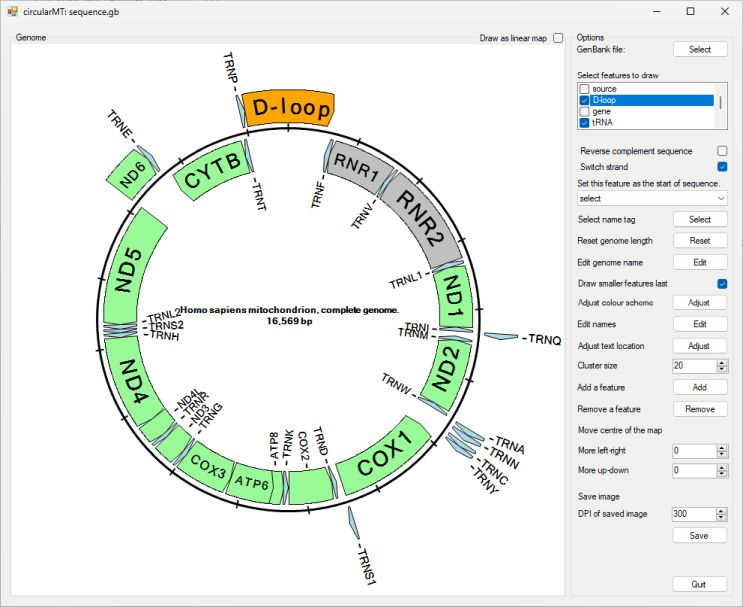

Figure 14: Checking the ```Switch strand``` option switches the feature's strand, but keeps the ordering of the genes

<hr />

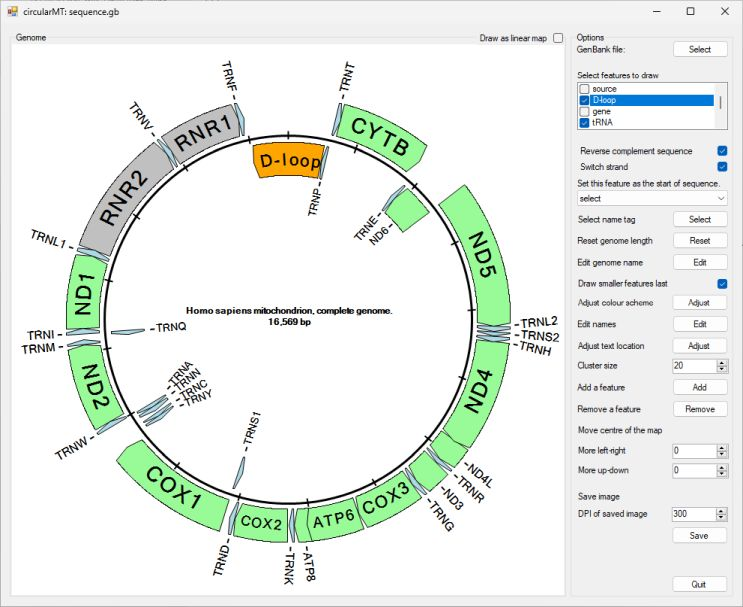

Figure 15: Checking the ```Reverse complement sequence``` and ```Switch strand``` option draws the sequences in the reverse order.

<hr />

## Adjusting the start point of the genome's annotation

When working with a range of genomes the starting positions may vary, resulting in displays that are not easily comparable to each or the start point dissects a feature, for instance the ***D-loop*** (see Figure 3 b), consequently it is possible to change the starting point of the annotation using the ```Set the feature as the start of sequence``` dropdown list (blue box in Figure 16).  Typically, mitochondrial genomes are draw with the start of tRNA encoding methionine at position 1. To set the ***TRNM*** feature as the start point select it's name from the ```Set the feature as the start of sequence``` dropdown list (blue box in Figure 16). This list contains all the currently drawn features, to aid selection, the name of the feature type is given followed by the feature's name. Once selected the genome will be redrawn such that the start of the selected feature is at 1 bp.

#### Note:

If you change one of the ```Reverse complement sequence``` or ```Switch strand``` options, you may have to reselect the feature as the genome may be drawn genome from the end of the feature and not the start.

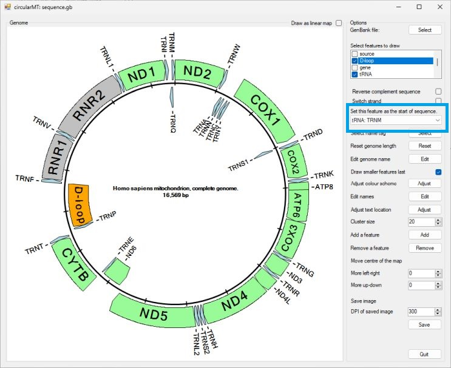

Figure 16: Selecting the tRNA: TRNM from the drop down list will set the start of the tRNA sequence as position 1 in the genome, rotating the image so TRNM is at 12 o' clock. 

<hr />

## Changing the feature's name to an alternative name in the data file

This option allows you to select different names for a feature based on data in the imported file. Some files may have a number of different names for a feature. Not all features will have a different name, but if they do they can be selected using the second drop down list that contains the ***Gene***, ***Product*** and  ***Gene_synoym*** options (see blue box in Figure 17). Figure 17 shows the results of selecting the ***product*** while viewing the genome as a circular map. This displays the protein/tRNA names. However, some names are too long and cross over in the middle of the image, while others go beyond the edge of the image. To try to limit this ```circularMT``` reduces the size of the circle that represents the genome, making the image smaller (Figure 17).


Figure 17: Selecting the ***Product*** option in the second drop down list results in the protein names been displayed, however, they are too long for the display. 

<hr />

Especially when drawing circular genomes, if the selected names are too long they may run off the edge of the image, this can be resolved by making ```circularMT's``` interface bigger (Figure 18) or possibly moving the center of the genome (see [Moving the genome's center point](#moving-the-genomes-center-point)).


Figure 18: Making the program's interface bigger helps resolve the issue. (Due to auto-scaling this image may not appear larger).

<hr />

#### Note:

Changing this option may give confusing results, for instance, if you select ***Product***, a feature will be given its ***Product*** name if it has one, while retaining the ***Gene*** name if it doesn't. If you then select ***Gene_synoym***, a feature will display their ***Gene_synoym*** if they have one, but either their ***Product*** name or ***Gene*** name if they don't, depending on the outcome of previously selecting ***Product***. If you select ***Gene*** all the features will probably display their ***Gene*** name as the majority of features have a ***Gene*** name

## Changing the displayed length of the genome

When importing data from a file such as a GTF file, you have to manually enter the size of the genome, as the file doesn't necessarily contain this information. This value is used to scale the features and so it's important to input the correct value. If this was incorrectly entered it is possible to change it by pressing the ```Reset``` button to the right of the ```Reset genome length``` label (blue box in Figure 19 a). This will display the ```Genome length``` form (Figure 19 b), changing the value in this dialog form and pressing ```OK``` will reset the length.  


Figure 19: Resetting the genome length with the ```Genome length``` dialog box. 

<hr />

## Changing the genome's name

The sequence's name and the genome's length is displayed in the center of the image. If the name is long, the font size is reduced to make it fit, however, for very long names it may become hard to read. This can be resolved by shortening or changing the name. This is done by pressing the ```Edit``` button next to the ```Edit genome name``` label (see blue box in Figure 20 a). This will display the ```Genome name``` dialog box, changing the value in the dialog box and pressing ```OK``` will change the displayed name (Figure 20 a and b).  


Figure 20: Resetting the genome's name with the ```Genome name``` dialog box. 

<hr />

## Drawing smaller features last

The genes on the mitochondrial genome are very tightly packed with some sequences over lapping. This may result in smaller features such as tRNAs being obscured by larger gene sequences. To reduce the affect of this, by default, features longer than 150 bp are drawn first and then any smaller features are draw over them. Unchecking the ```Draw smaller features last``` option will cause the features to be drawn in the order the feature types are listed in the check box list in the top right of the interface, with each feature in the set drawn in their positional order. Figure 21 shows the affect on trnl2(taa) sequence (this was not drawn using the human mitochondrial used in the rest of the images in this guide) when the option is turned off (A) and turned on (B).


Figure 21
<hr />

## Changing the colour of one or more features

Initially, the colours of each type of feature is based on the order in which the feature types first occur in the file, to make a nicer display, it is possible to change the colour of a feature type or specific subset of features by pressing the ```Adjust``` button to the right of the ```Adjust colour scheme``` label (see blue box in Figure 22). This will display the ```Adjust feature colours``` dialog form that allows the selection of the features to change and their new colour (Figure 22).

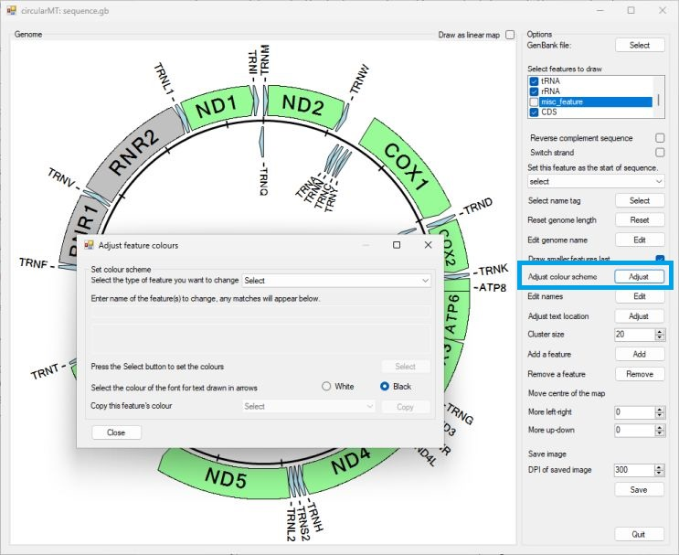

Figure 22: The ```Adjust feature colours``` dialog box allows the colour of the features to be changed. 

<hr />

The ```Adjust feature colours``` dialog box consists of a drop down list of the different types of features and a text box that is disabled when the dialog box appears. To select a feature, first select the type of feature from the drop down list (see blue box in Figure 23).


Figure 23

<hr />

Once a feature type has been selected the text box will be active, initially all the features of the chosen type will be selected and their names will appear in a list below the text box (see blue box in Figure 24). The selected features will also be drawn with a red perimeter in the display to verify their selection. Typing the name of the feature in the now active text box, will reduce the list of selected items to those whose name starts with the entered text (not case sensitive). For instance in Figure 24, the ***CDS*** feature type was selected and 'ND' has been entered and so only the ***CDS*** features ***ND1***, ***ND2***, ***ND3***, ***ND4***, ***ND4L***, ***ND5*** and ***ND6*** are selected.

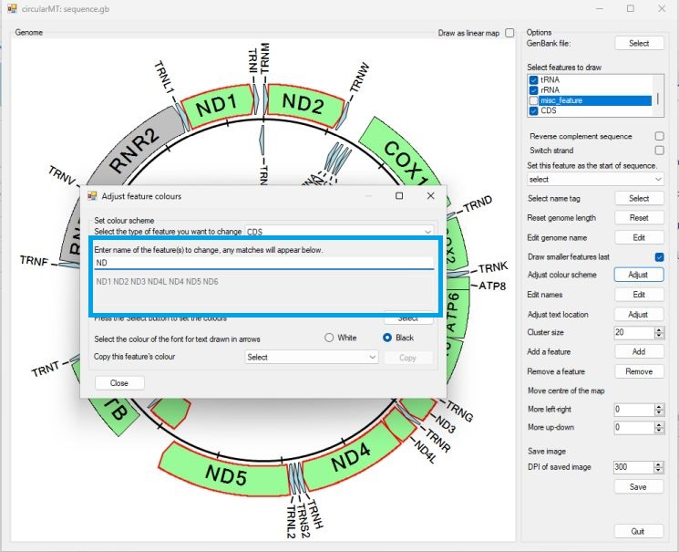

Figure 24: All terms in the ***CDS*** class beginning with "ND" are select as shown by the name in the text area below the text bow and their red perimeter in the display.

<hr />

Once the features have been selected, press the ```Select``` button in the lower right corner of the form to display the ```Colour``` dialog form and pick the desired colour (Figure 25) and then press the ```OK``` button. This will close the colour selection dialog form and re-colour the image, in this case all of the CDS features whose names start with 'ND' are pale blue (Figure 26).

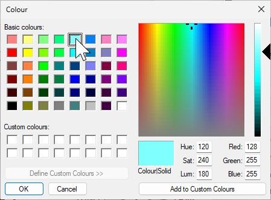

Figure 25

<hr />

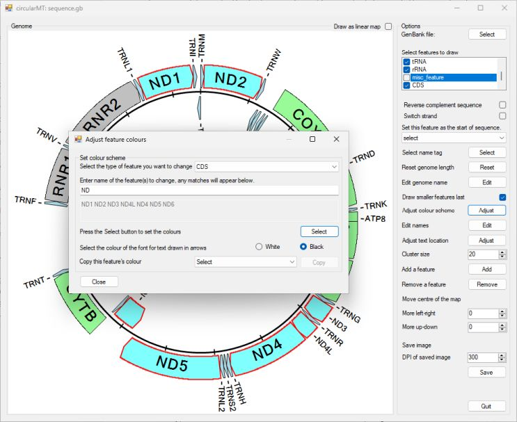

Figure 26; Pressing the ```OK``` button changes the selected features colours.

<hr />

## Changing the font colour of one or more features

Once you have selected one or more features as described above, you can switch their font colour from black to white, by checking the appropriate radio button (labelled ```White``` and ```Black```) located below the ```Select``` button (see blue box in Figure 27)

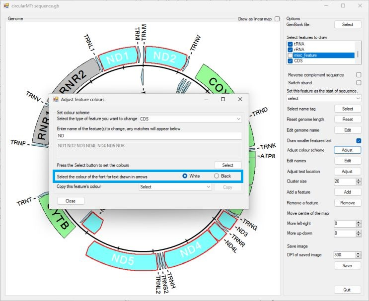

Figure 27

<hr />

## Copying the colour scheme from one feature to another

The colour selection dialog box allows you to select a colour from a preset collection of colours or to create a custom colour. WHile custom colours may create a better image, it can be difficult to create the same colour for features that can't be selected as a subset. Consequently, its possible to select a donor feature that you have previously coloured using the drop down list above the ```Select``` button. Once select, select other features as described above and then press the ```Copy``` button to the right of the drop down list (blue box in Figure 28). 


Figure 28
<hr />

In Figure 28, ND1 was selected as the donor feature, while all CDS features whose name started with "CO" were selected as the recipient features. Pressing the ```Copy``` button transfers the colour scheme from the donor ND1 feature to the all the recipient features (Figure 29).


Figure 29
<hr />

## Manually editing a feature's name

The name of each feature is obtained from the data file, if you wish to change their names, press the ```Edit``` button to the right of the ```Edit names``` label (see blue box in Figure 30 a). This will open the ```Edit feature names``` dialog box, which is similar to the ```Adjust feature colours``` dialog box. To edit a feature, first select its type from the drop down list (Figure 30 b) and start to type the name of the feature you wish to change in to the text area below the drop down list: -this is case sensitive (see blue box in Figure 31). When the entered text matches just one feature, the lowest text box area will be come active allowing you to enter the new name (see red box in Figure 31). As with other dialog boxes, the selected feature will be drawn with a red perimeter.


Figure 30
<hr />

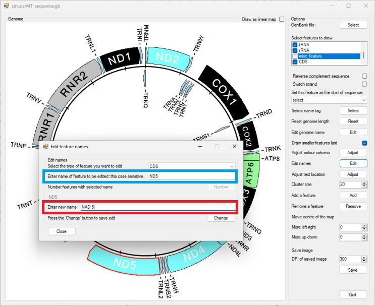

Figure 31
<hr />

Pressing the ```Change``` button in the lower right of the form will rename the feature in the display (see text underlined by the black line in Figure 32). The ```Edit feature names``` form will remain open, allowing you to edit multiple features.


Figure 32: The "ND5" feature is now labeled "NAD 5" (text underlined by the black line)
<hr />

#### Note: 
The name changes are not permanent; changing the selected value in the ```Select name tag``` drop down list will reset the values to these from the file.

## Manually moving text written next to a feature

If the arrow is small its name is written perpendicular to the arrow. If a series of tRNAs create a tandem array ```circularMT``` will spread out the names so they do not clash. However, this does not always work, consequently there are three ways to manually correct the positioning of the text. Figure 33 a shows the map of the Example-14789_bp.bed file (download [here](../Example%20data/Eaxmple-14780_bp.bed)) in which the nad3 and the TRNA names clash (The erroneous origins of replication have been removed as described [here](#removing-a-feature)). 

#### Note
This section only refers to text written next to a feature, text in an arrow can not be modified.

### Resizing the image

While it may seem to be cheating, perhaps the easiest thing to do is make the image large by maximising ```circularMT's``` interface and then reducing the exported image size when inserting it in to a document. This is especially true for linear maps.

### Changing the ```Cluster size``` value

A simple way to resolve this issue is to change the ```Cluster size``` value (see blue boxes in Figure 33 a and b). This cut off is used to determine if two features clash, the smaller the value the closer two pieces of text most be before they are rearranged. In Figure 33 a the value is set at the default value of 20, while in Figure 33 b it has been increased to 38 which causes the ***nad3*** text to move away from the ***trnA(tgc)*** text (blue arrow in Figures 33 a and b). 


Figure 33
<hr />

### Rotating and changing the X and Y coordinates of a features name 

When writing text in the circular map, the reference point (x = 0, y = 0) is moved and ultimately ends up at the position of the blue circle in Figure 34 c. The image is rotated so the text is written from left to right as normal, so when the image is rotated back to its starting the point the text is at an angle. Consequently for circular maps, moving the text backwards and forwards moves it along the blue line in Figure 34 a, moving the text up and down moves it along the line in Figure 34 b, while rotating it, rotates it around the blue circle in Figure 34 c. While not as extreme, the same situation occurs with the vertical text in the linear maps. Due to the simpler nature of the linear maps, vertical text can only be moved in one axis: the other options are disabled.  

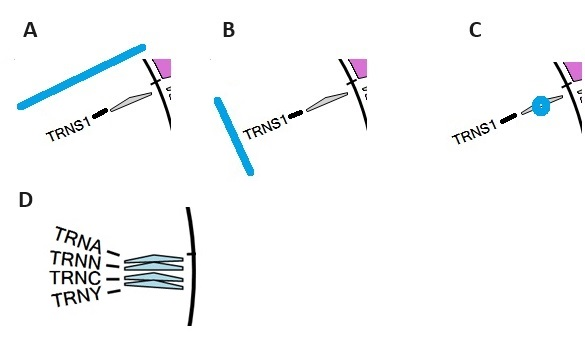

Figure 34
<hr />

To move the location of a feature's name press the ```Adjust``` button  (see blue box in Figure 35). This opens the ```Adjust text location``` dialog box (Figure 35). 


Figure 35
<hr />

First, select the features type from the upper drop down list (in this file all the features are of type feature) and then enter its name in the text box (see blue box in figure 36). Once a single feature has been selected, the number controls will be come active (see red box in Figure 36). Adjusting these values will more the text, in Figure 36 the name of the "nad3" feature has been rotated -4 degrees so it no longer clashes with the trnA text (see blue arrow in Figure 36).

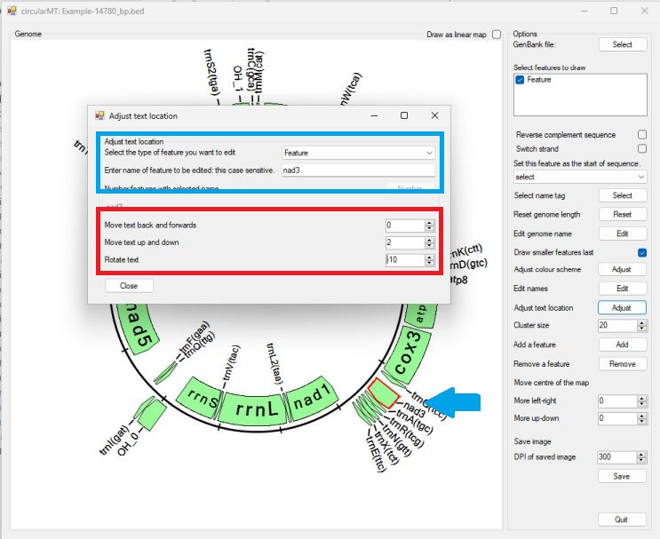

Figure 36
<hr />

## Adding a feature

During the annotation process, some sequences will be missed, if you have a strong reason to believe a feature should be added, you can do this by pressing the ```Add``` button to the right of the ```Add a feature``` label (see blue box in Figure 37). This will open the ```Add a feature``` form: select the feature (in this case ***Features*** is the only option and then enter the relevant information: name - rrnl,  start point - 6,849 bp, Length - 1200 bp and strand - Inner circle (figure 37).

#### Note:
 The figures in this section were made using the [Example-14789_bp.bed](../Example%20data/Eaxmple-14780_bp.bed) file and then the rrnL feature was deleted as described in the [Removing a feature](#removing-a-feature) section. 


Figure 37
<hr />

Pressing the ```Add``` button in the lower right of the form will add the feature to the image (Figure 38). The feature can now be edited like any other feature.

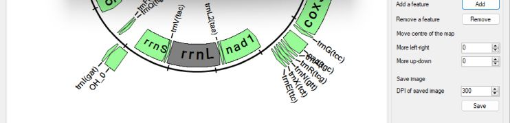

Figure 38
<hr />

## Removing a feature

During the annotation process extra features may be erroneously added, for instance in Figure 32, extra replication origins have been added: ***OH_3a***, ***OH_3b***, ***OH_2a*** and ***OH_2b*** (Figure 39). 


Figure 39
<hr />

To remove unwanted features, click the ```Remove``` button next to the ```Remove a feature``` label (see blue box next in Figure 39) to open the ```Delete feature(s)``` form. Once opened, select the feature type from the drop down list at the top right of the form (see blue box in Figure 40) and enter the name of the feature in the text box (this is case sensitive) (red box in Figure 40). If the text matches one or more features, the lower right ```Delete``` button will be enabled.


Figure 40: The text "OH_2" matches the ***OH_2a*** and ***OH_2b*** features. Pressing the ```Delete``` button will delete them from ```circularMT's``` data set. 

 Pressing the ```Delete``` button will delete any feature of the selected feature type, whose name starts with the entered text (this is case sensitive) (Figure 41). Once deleted, they can not be retrieved, you'll have to either re-enter the file or use the ```Add feature``` function described above. 

 


Figure 41: Using the ```Delete feature(s)``` form, the unwanted ***OH_3a***, ***OH_3b***, ***OH_2a*** and ***OH_2b*** features have been removed.
<hr />

#### Note:
If a number of features have the same name, but you only want to delete some of them, open the ```Edit feature names``` dialog box ([see here](#manually-editing-a-features-name)) and select the feature type and enter the feature's name and then press the Number button below the  text area you entered the feature's name in. This will number the feature's names allowing you to select specific features. Once, you have done, reselect ***Gene*** option from the ```Select name tag``` drop down list ([see here](#changing-the-features-name-to-an-alternative-name-in-the-data-file)).

## Moving the genome's center point

By default, the center of the circle representing the genome is placed in the middle of the image area and the circle is rescaled to stop text overrunning the edge of the image. However, for images with long feature names the scaling process may be stopped to make sure the image doesn't become too small and the text over runs the edge of the image or the image is smaller than you'd like (Figure 42). This can be resolved by moving the center of the image so the the text doesn't over run. 

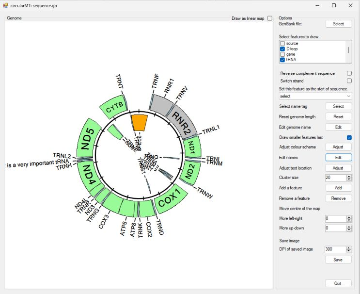

Figure 42: The renamed TRNF sequence causes the image to be too small.
<hr />

The two number selection controls to the right of the ```Move left-right``` amd ```Move up-down``` labels (see blue box in Figure 42) allow the position of the center of the genome to be moved. As the center moves the image will resize itself to try to stop text over running the image area. Setting the value in the control to the right of the ```Move left-right``` label to ***80***, will shift the image to the right allowing it to increase in size while still displaying the edited text for the TRNF tRNA feature (Figure 43).

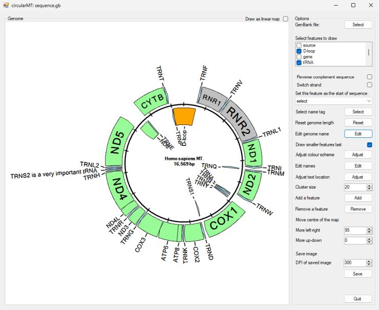

Figure 43: Moving the image's center down by '80' using the ```Move up-down``` control creates a better image.
<hr />

#### Note
Since linear maps do not write text that projects to the sides of the genome map, its only possible to move the image up or down.

## Saving the image to a 300 dpi image

Once you are happy with the display image , it can be saved as a 300 (are just over) dpi TIFF, bitmap, PNG or JPEG image by pressing the ```Save``` button to the right of the ```Save image``` label (see blue box in Figure 44 a). This will prompt you to enter a location and file name before saving the image. 


Figure 44: Pressing the ```Save``` button will save the current display image to a 300 dpi TIFF, PNG, Bitmap or JPEG image file. 
<hr />

Saving the image to a greater resolution will also sharpen up the text written at near vertical angles which may appear scrappy in the user interface where it is drawn at ~96 dpi (Figure 45 a and b).

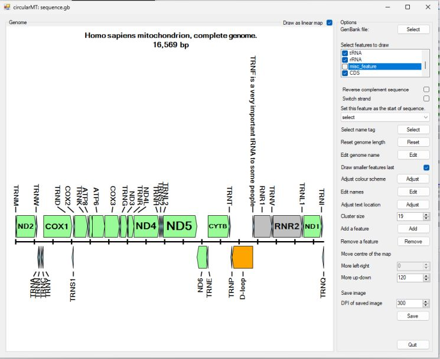

Figure 45: While the text can appear scrappy in the user interface (Figure 45 a), saving the genome map to a 300 dpi image creates  smoother, clearer text when shown at the same size (Figure 45 b). 
<hr />