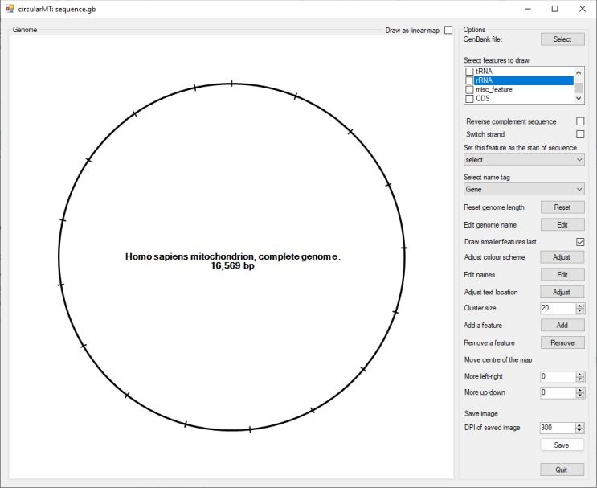
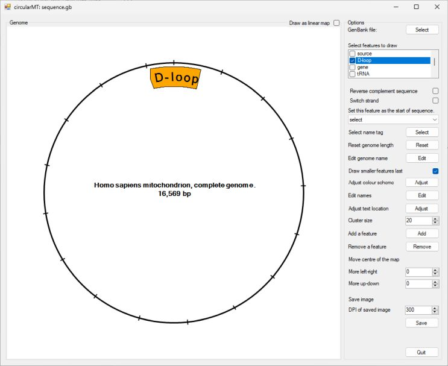
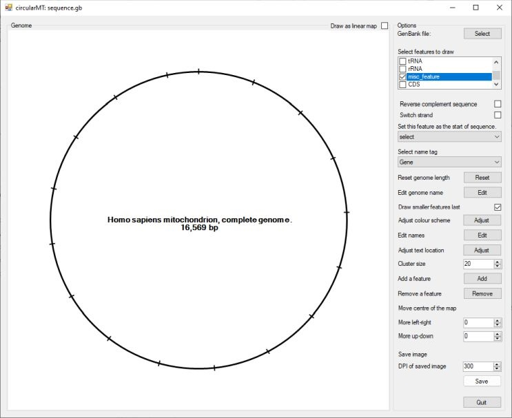
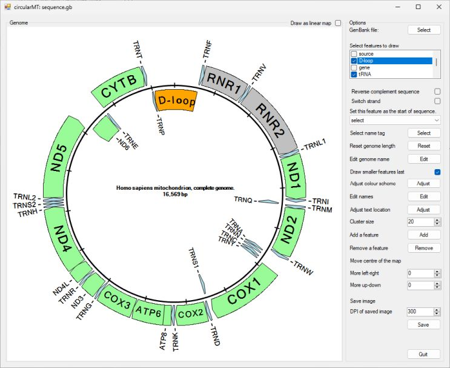
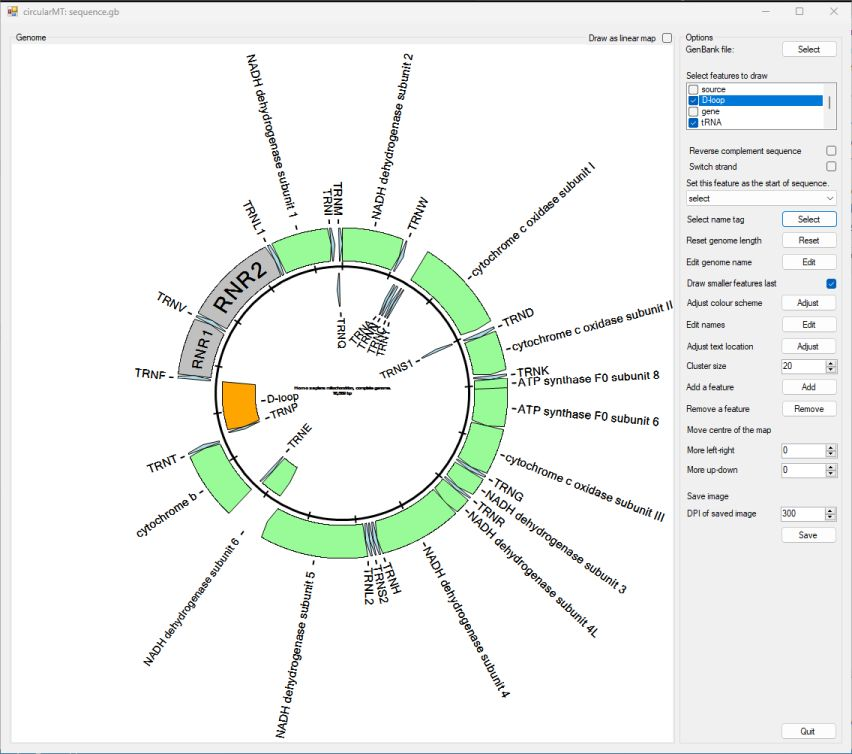
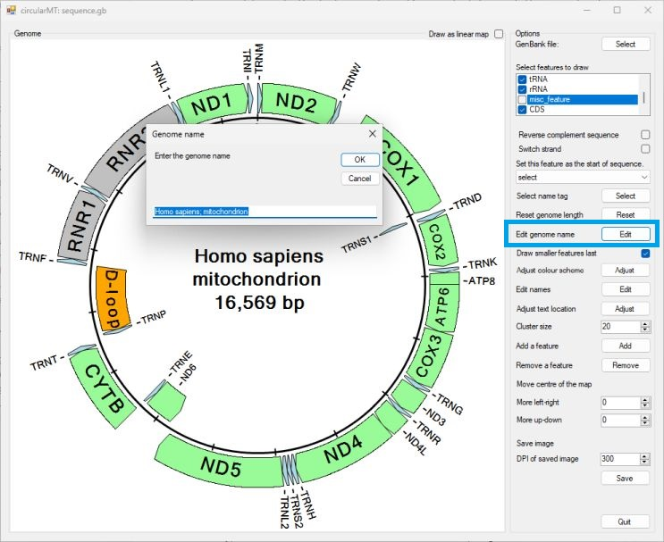

# ```circularMT``` user guide

```circularMT``` is able to read a range of file formats such as Genbank, mitos, seq, bed, fasta, gtf and gff files. For a description of each of these files can be found [here](FileFormats.md).

```circularMT``` consists of a large drawing ```Genome``` panel to the left and a single ```Options``` panel to the right (figure 1). On start up the drawing area consists of just a black circle.


Figure 1
<hr />

To enter a file press the ```Select``` button at the top of the ```Options``` panel and select a file. Since a large number of file formats do not contain the length of the genome, before processing the file ```circularMT``` may prompt you for length of the sequence (Figure 2). 


Figure 2
<hr />

 In Figure 3 the human mitochondrial genome Genbank file was selected [(download)](../Example%20data/sequence.gb) resulting in the image shown in figure 3.


Figure 3
<hr />

This image displays all the features found in the file as a series of arrows flanking the black circle that represents the genome. The start of the sequence is at 12 o' clock and is draw clockwise from there. Each 1 kb is marked by a line cutting the circle. The features on the outside of the circle are on the forward strand, while those on the inside are on the reverse strand. All the features are draw even if one feature covers another, for example the COX1 gene occurs in the gene and CDS feature sets. This is especially obvious for the tRNAs genes. Since there is not enough room write the tRNA's name in the arrow, it draw next to the arrow. If a number of tRNA occur in tandem, their names are fanned out to prevent them over-writing each other. However, the clusters of tRNA at about 4 and 9 o' clock contain multiple tRNAs, each duplicated in the tRNA and gene feature set, and due to the number of features ```circularMT``` as issues writing the name. This can be resolved by selecting which features to draw.

## Selecting which features to display

Just below the ```Select``` button used to pick the data file is a check box list control that lists all the different types of features found in the file. In this case there are ***source***, ***D-loop***, ***gene***, ***tRNA***, ***rRNA***, ***misc-feature*** and ***CDS***. The names of the features and what they contain depends on the data files so another file may have completely difference set. If all the features are unchecked, no features will be shown. Figures 4 to 11 shows the effect of unchecking all the options and then checking each one in turn.



Figure 4: No features selected
<hr />


Figure 5: The ***source*** feature is selected, as this is represents the whole genome it is never draw ```circularMT``` will not show features longer that 1/3 of the genome's length.
<hr />



Figure 6: The ***D-loop*** feature(9)s) is drawn. This feature only contains D-loops.
<hr />


Figure 7: The ***gene*** features are drawn, this includes the protein coding genes, rRNas and tRNAs.
<hr />


Figure 8: The ***tRNA*** features are drawn. This feature only contains tRNAs.
<hr />


Figure 9: The ***rRNA*** features are drawn. This feature only contains rRNAs.
<hr />



Figure 10: The ***misc_features*** are drawn: In this file the misc_features are 1 bp and so are not drawn.
<hr />


Figure 11: The ***CDS*** features are drawn: This feature only contains protein coding sequences.
<hr />

As can be seen from the preceding figures there may be a number of ways to display the individual sequences you are interested in. What options you select is very dependant on the data file and your needs. Generally speaking, to easily produce a nice image its best to select features that only contain one type sequence, in this case the ***D-loop***, ***tRNA***, ***rRNA*** and ***CDS*** options were selected to create Figure 12.



Figure 12: The th ***D-loop***, ***tRNA***, ***rRNA*** and ***CDS*** were selected such that each feature was drawn once.

<hr />

## Changing the order and/or the strands of the sequences

When working with a de novo assembled genome the contig may not be in the preferred orientation, or the sequence are annotated on the wrong strand. These issues can be resolved by checking one or both of the ```Reverse complement sequence``` or ```Switch strand``` options below the check box list options (Figure 13, 14 and 15).


Figure 13: Checking the ```Reverse complement sequence``` option switches the features strand and draws the sequences in the reverse order.

<hr />


Figure 14: Checking the ```Switch strand``` option switches the features strand, but keeps the ordering of the genes

<hr />


Figure 15: Checking the ```Reverse complement sequence``` and ``Switch strand``` option draws the sequences in the reverse order.

<hr />

## Changing the starting point of the genome

When working with a de novo assembled genome the contig may not start at the conventional point. Typically, mitochondrial genomes are draw with the start of tRNA encoding methionine as position 1. To rotate the image select the methionine tRNA from the dropdown list below the ```Switch strand``` option (Figure 16). The dropdown list is populated by all the currently draw features. To aid selection, the name of the feature type is shown followed by the feature's name.


Figure 16: Selecting the tRNA: TRNM from the dropdown list will set the start of the tRNA sequence as position 1 in the genome, rotating the image so TRNM is at 12 o' clock. 

<hr />

## Changing the feature's name for another one in the data file

Some files may have a number of different names for a feature.Not all features will have a different name, but if they do they can be selected using the second dropdown list that contains the ***Gene***, ***Product*** and  ***Gene_synoym***. Figure 17 shows the results of selecting the ***product***. This displays the fuller protein/tRNA names. However, some names are too long and cross over in the middle of the image, while other go beyond the edge of the image. To try to limit this ```circularMT``` reduces the size of the font used to write the text and make the image smaller (Figure 17). 


Figure 17: Selecting the product option in the second dropdown list results in the protein names been displayed, however, they are too long for the display. 

<hr />

This can be resolved by making ```circularMT's``` interface bigger.



Figure 18: Making the program's interface bigger helps resolve the issue. 

<hr />

## Changing the displayed length of the genome

When entering the a file such as a GTF file, you have to manually enter the size of the genome as the file doesn't necessarily contain the information. If this was in correctly entered it is possible to change it by pressing the ```Reset``` button to the right of the ```Reset genome length``` label. This will display the ```Genome length``` form (Figure 19), changing the value in the form and pressing ```OK``` will reset the length.  


Figure 19: Resetting the genome length with the ```Genome length``` form. 

<hr />

## Changing the Sequence's name

In the center of the image, the sequence's name is displayed. If the name is long, the font size is reduced to make it fit, however, for long names it may become hard to read. This can be resolved by shortening the name or changing it. This can be done by pressing the ```Edit``` button next to the ```Edit genome name``` label. This will display the ```Genome name``` form (Figure 20), changing the value in the form and pressing ```OK``` will reset the name.  



Figure 20: Resetting the genome's name with the ```Genome name``` form. 

<hr />