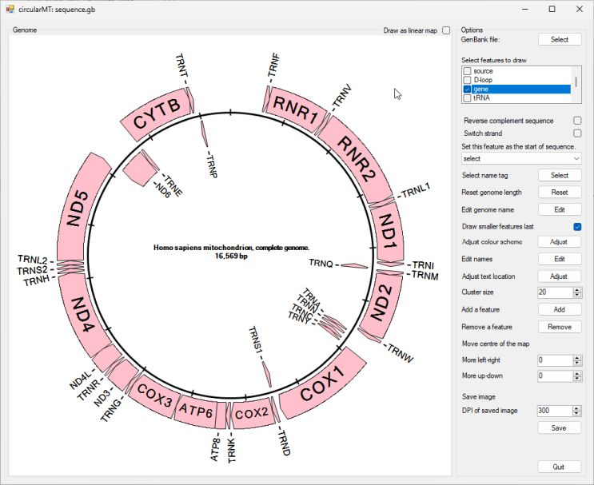
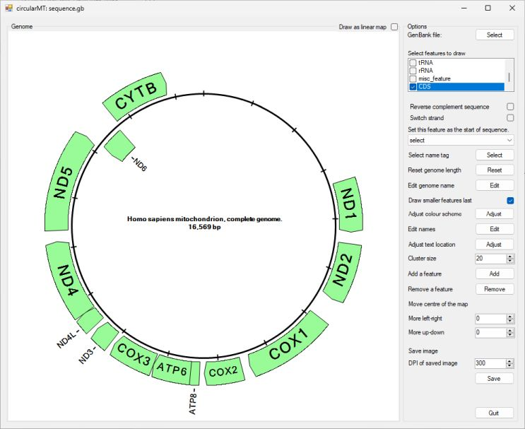
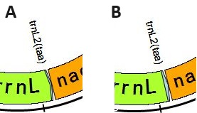
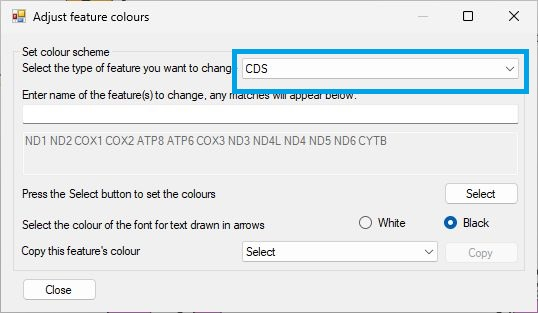
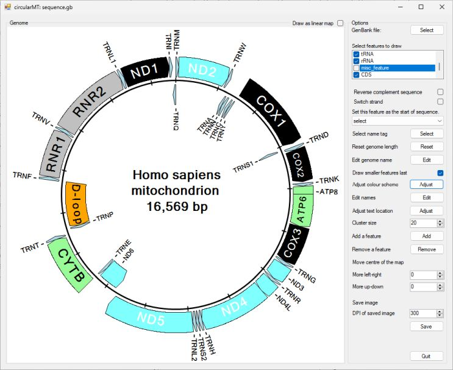
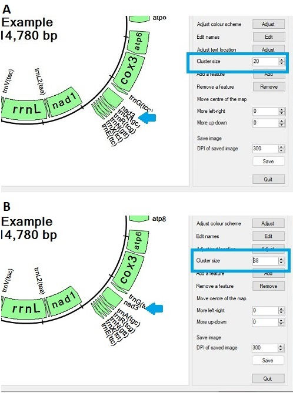
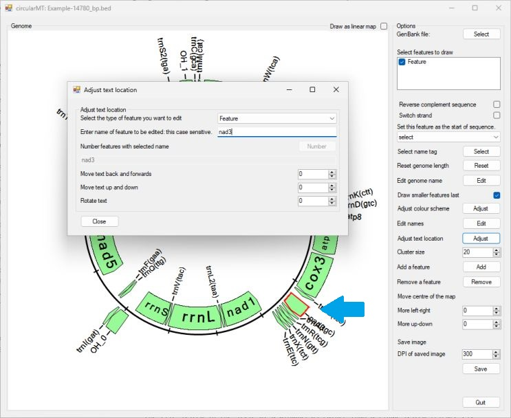
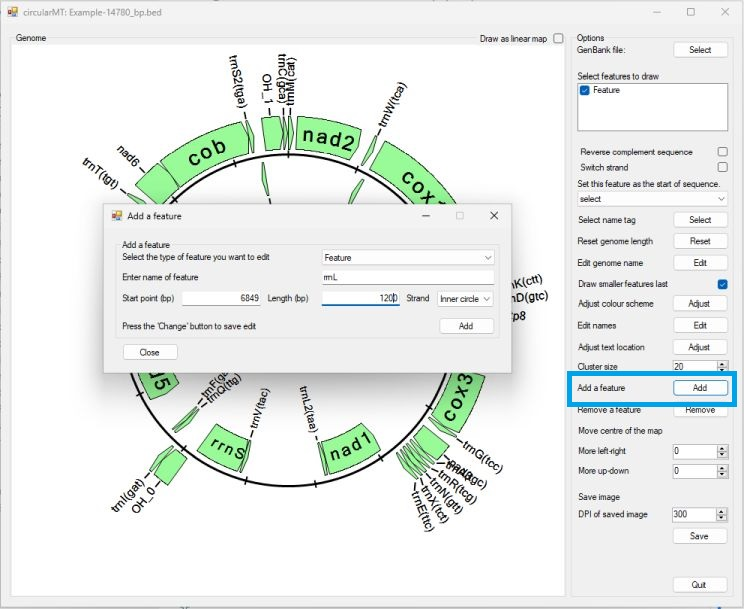

# ```circularMT``` user guide

### Contents
- ```circularMT``` user guide  
  - [Introduction](#introduction)  
    - [File formats](#file-formats) 
    -  [```circularMT's``` interface](#circularmts-interface)
  - [Entering data](#entering-data)
  - [Selecting which features to display](#selecting-which-features-to-display)  
  - [Changing the order and/or the strands of the sequences](#changing-the-order-andor-the-strands-of-the-sequences)  
  - [Changing the starting point of the genome](#changing-the-starting-point-of-the-genome)  
  - [Changing the feature's name to an alternative name in the data file](#changing-the-features-name-to-an-alternative-name-in-the-data-file)  
  - [Changing the displayed length of the genome](#changing-the-displayed-length-of-the-genome)  
  - [Changing the genome's name](#changing-the-genomes-name)
  - [Changing the features colour](#changing-the-features-colour)  
  - [Drawing smaller features last](#drawing-smaller-features-last)  
  - [Manually editing a feature's names](#manually-editing-a-features-names)  
    - [Note](#note)
  - [Adding a feature](#adding-a-feature)  
  - [Removing a feature](#removing-a-feature)
  - [Moving the genome's center point](#moving-the-genomes-center-point)
  - [Saving the image to a 300 dpi image](#saving-the-image-to-a-300-dpi-image)  


## Introduction

#### File formats 
```circularMT``` is able to read a range of file formats such as Genbank, mitos, seq, bed, fasta, gtf and gff files. A description of the required formatting of each of these files can be found [here](FileFormats.md).

#### ```circularMT's``` interface

```circularMT``` consists of a ```Genome``` panel located on the left in which the genome is displayed and an ```Options``` panel to the right that contains all the controls that allow you to modify the display. On start up the drawing area consists of just a black circle (Figure 1).


Figure 1
<hr />

## Entering data

To import a file, press the ```Select``` button at the top of the ```Options``` panel and select a file (In blue box in Figure 1). Since a large number of file formats do not explicitly contain the length of the genome, before processing the file ```circularMT``` may be prompted for length of the sequence (Figure 2). If prompted, enter the genome's length and press ```OK```. 


Figure 2
<hr />

 In Figure 3 the human mitochondrial genome Genbank file was selected [(download)](../Example%20data/sequence.gb) resulting in the image shown in figure 3.


Figure 3
<hr />

This image displays all the features found in the file as a series of arrows flanking the black circle which represents the genome. The start of the sequence (1 bp) is at 12 o' clock and is draw clockwise from there. Each 1 kb is marked by a line cutting the circle. The features on the outside of the circle are on the forward strand, while those on the inside are on the reverse strand. Initially, all the features in the file are draw unless the feature is either 1 bp long or longer than 1/3 of the genomes length.  

If there is room the name of the feature is drawn in the arrow, otherwise it is written at 90 degrees to the feature. However, if the feature is on the inside of the circle and its name is particularly long the name will be written outside the circle.  

Features are draw even if one feature obscures another, this is especially obvious for the tRNAs genes. Since there is not enough room write the tRNA's name in the arrow, it draw next to the it. If a number of tRNAs occur in tandem, their names are fanned out to prevent them over-writing each other. However, the clusters of tRNA at about 4 and 9 o' clock contain multiple tRNAs, each duplicated in the tRNA and gene feature set, and due to the number of features ```circularMT``` as issues writing the names. This can be resolved by selecting which features to draw as described below.

## Selecting which features to display

Just below the ```Select``` button used to pick the data file is a check box list control that lists all the different types of features found in the file (see blue box in Figure 4). In this case there are ***source***, ***D-loop***, ***gene***, ***tRNA***, ***rRNA***, ***misc-feature*** and ***CDS***. The names of the features and what they contain depends on the data files so another file may have completely difference set. If all the features are unchecked, no features will be shown (Figure 4). Figures 4 to 11 shows the effect of unchecking all the options and then checking each one in turn.


Figure 4: No features selected
<hr />


Figure 5: The ***source*** feature is selected; in this case this feature represents the whole genome and because it is longer than 1/3 of the genome's length it is not drawn.
<hr />


Figure 6: The ***D-loop*** feature(s) are selected. This feature set only contains D-loops.
<hr />



Figure 7: The ***gene*** features are drawn, this includes the protein coding genes, rRNAs and tRNAs.
<hr />


Figure 8: The ***tRNA*** features are drawn. This feature only contains tRNAs.
<hr />


Figure 9: The ***rRNA*** features are drawn. This feature only contains rRNAs.
<hr />


Figure 10: The ***misc_features*** are drawn: In this file the misc_features are 1 bp long and so are not drawn.
<hr />



Figure 11: The ***CDS*** features are drawn: This feature only contains protein coding sequences.
<hr />

As can be seen from the preceding figures there may be a number of ways to display the individual sequences you are interested in. What options you select is very dependant on the how the data file is arranged and your needs. Generally speaking, to easily produce a nice image its best to select feature sets that only contain one type feature, in this case the ***D-loop***, ***tRNA***, ***rRNA*** and ***CDS*** options were selected to create Figure 12.


Figure 12: The ***D-loop***, ***tRNA***, ***rRNA*** and ***CDS*** were selected such that each feature was drawn once.

<hr />

## Changing the order and/or the strands of the sequences

When working with a de novo assembled genome the contig may not be in the preferred orientation, or the sequence are annotated on the wrong strand. These issues can be resolved by checking one or both of the ```Reverse complement sequence``` or ```Switch strand``` options below the check box list options (see blue box in Figure 13). Figures 13, 14 and 15 show the affect of selecting these options.


Figure 13: Checking the ```Reverse complement sequence``` option switches the feature's strand and draws the sequences in the reverse order.

<hr />


Figure 14: Checking the ```Switch strand``` option switches the feature's strand, but keeps the ordering of the genes

<hr />


Figure 15: Checking the ```Reverse complement sequence``` and ```Switch strand``` option draws the sequences in the reverse order.

<hr />

## Changing the starting point of the genome

When working with de novo assembled genomes, the contigs may not start at the same position resulting in displays that have the displays rotated relatively each other. Typically, mitochondrial genomes are draw with the start of tRNA encoding methionine as position 1. To rotate the image, select the methionine tRNA from the drop down list below the ```Switch strand``` option (see blue box in Figure 16). The drop down list is populated with all the currently draw features. To aid selection, the name of the feature type is shown followed by the feature's name.


Figure 16: Selecting the tRNA: TRNM from the drop down list will set the start of the tRNA sequence as position 1 in the genome, rotating the image so TRNM is at 12 o' clock. 

<hr />

## Changing the feature's name to an alternative name in the data file

This option allows you to select different names for a feature based on data in the imported file.

Some files may have a number of different names for a feature. Not all features will have a different name, but if they do they can be selected using the second drop down list that contains the ***Gene***, ***Product*** and  ***Gene_synoym*** (see blue box in Figure 17). Figure 17 shows the results of selecting the ***product***. This displays the protein/tRNA names. However, some names are too long and cross over in the middle of the image, while others go beyond the edge of the image. To try to limit this ```circularMT``` reduces the size of the font used to write the text and makes the image smaller (Figure 17). 


Figure 17: Selecting the ***Product*** option in the second drop down list results in the protein names been displayed, however, they are too long for the display. 

<hr />

This can be resolved by making ```circularMT's``` interface bigger.


Figure 18: Making the program's interface bigger helps resolve the issue. 

<hr />

## Changing the displayed length of the genome

When importing data from a file such as a GTF file, you have to manually enter the size of the genome, as the file doesn't necessarily contain this information. If this was incorrectly entered it is possible to change it by pressing the ```Reset``` button to the right of the ```Reset genome length``` label (See blue box in Figure 19 a). This will display the ```Genome length``` form (Figure 19 b), changing the value in the form and pressing ```OK``` will reset the length.  


Figure 19: Resetting the genome length with the ```Genome length``` form. 

<hr />

## Changing the genome's name

The sequence's name is displayed in the center of the image a long with the sequence's length. If the name is long, the font size is reduced to make it fit, however, for very long names it may become hard to read. This can be resolved by shortening or changing the name. This can be done by pressing the ```Edit``` button next to the ```Edit genome name``` label (see blue box in Figure 20). This will display the ```Genome name``` form (Figure 20), changing the value in the form and pressing ```OK``` will change the displayed name.  


Figure 20: Resetting the genome's name with the ```Genome name``` form. 

<hr />

## Changing the features colour

Initially, the colours of each type of feature is based on the order in which the feature types first occur in the file, to make a nicer display, it is possible to change the colour of a feature type or specific subset of features by pressing the ```Adjust``` button to the right of the ```Adjust colour scheme``` button(see blue box in Figure 21). This will display the ```Adjust feature colours``` window that allows the selection of the features to change and the new colour (Figure 21).



Figure 21: The ```Adjust feature colours``` window allows the colour of the features to be changed. 

<hr />

The ```Adjust feature colours``` form consists of a drop down list of the different type of features and a text box that is disabled when the form appears. To select a feature, first select the type of feature from the drop down list (see blue box in Figure 22).


Figure 22

<hr />

Once a feature type has been selected the text box will be active, initially all the features of the chosen type will be selected and their names will appear in a list below the text box (see blue box in Figure 23). Typing the name of the feature in the now active text box, will reduce the list of selected items to those whose name starts with the entered text (not case sensitive). For instance in Figure 23, 'ND' has been entered and so only the CDS features ***ND1***, ***ND2***, ***ND3***, ***ND4***, ***ND4L***, ***ND5*** and ***ND6*** are selected.



Figure 23

<hr />

Once the features have been selected, press the ```Select``` button in the lower right corner of the form to display the ```Colour``` dialog form and pick the desired colour (Figure 24) and press the ```OK``` button. This will close the colour selection dialog form and recolour the image, in this case all of the CDS features whose names start with 'ND' are pale blue (Figure 25).


Figure 24

<hr />


Figure 25

<hr />

## Drawing smaller features last

The genes on the mitochondrial genome are very tightly packed with some sequences over lapping. This may result in smaller features such as tRNAs being obscured by larger gene sequences. To reduce the affect of this, by default, features longer than 150 bp are drawn first and then smaller features are draw. Unchecking the ```Draw smaller features last``` option will cause the features to be drawn in the order the feature types are listed in the check box list in the top right of the interface, with each feature in the set drawn in their positional order. Figure 26 shows the affect on trnl2(taa) sequence (this was not drawn using the human mitochondrial used in the rest of the images in this guide) when the option is turned off (A) and turned on (B).


Figure 26
<hr />

## Manually editing a feature's names

The name of each feature is obtained from the data file, if you wish to change their names, press the ```Edit``` button to the right of the ```Edit names``` label(see blue box in Figure 27 a). This will open the ```Edit feature names``` form, which is similar to the ```Adjust feature colours``` form. To edit a feature, first select its type from the drop down list (Figure 27 b) and the start to type the name of the feature you wish to change in to the text area below the drop down list: -this is case sensitive (see blue box in Figure 28). When the entered text matches just one feature - only one feature appears in the text area below, the lowest text area will be come active allowing you to enter the new name (see red box in Figure 28). 


Figure 27
<hr />


Figure 28
<hr />

Pressing the ```Change``` button in the lower right of the form will rename the feature in the display (Figure 29). The ```Edit feature names``` form will remain open, allowing you to edit multiple features.



Figure 29
<hr />


#### Note: 
The name changes are not permanent; changing the selected value in the ```Select name tag``` drop down list will reset the values to these from the file.

## Adding a feature

During the annotation process, some sequences will be missed and not included, if you have a strong reason to believe a feature should be add, you can do this by pressing the ```Add``` button to the right of the ```Add a feature``` label (see blue box in Figure 30 a). __The figures in this section were made using the a different file the majority of this guide, from which ***rrnl*** has been removed.__ This will open the ```Add a feature``` form: select the feature (in this case ***Features*** is the only option and then enter the relevant information (figure 30 b).


Figure 30
<hr />

Pressing the ```Add``` button in the lower right of the form will add the feature to the image (Figure 31). The feature can now be edited like any other feature.


Figure 31
<hr />

## Removing a feature

During the annotation process extra features may be erroneously added, in Figure 32, extra replication origins have been added: ***OH_4***, ***OH_3***, ***OH_2a*** and ***OH_2b*** (Figure 32). 


Figure 32
<hr />

To remove unwanted features, click the ```Remove``` button next to the ```Remove a feature``` label (see blue box next in Figure 32) to open the ```Delete feature(s)``` form. Once opened, select the feature type from the drop down list at the top right of the form (see blue box in Figure 33) and enter the name of feature in the activated text box (this is case sensitive) (see red box in Figure 33). If text matches one or more features, the lower right ```Delete``` button will be enabled.



Figure 33: The text "OH_2" matches the ***OH_2a*** and ***OH_2b*** features. Pressing the ```Delete``` button will delete them from ```circularMT's``` data set. 

 Pressing the ```Delete``` button will delete any feature of the selected feature type, whose name starts with the entered text (this is case sensitive) (Figure 34). Once deleted, they can not be retrieved, you'll have to either reenter the file or use the ```Add feature``` function described above. 

 


Figure 34: Using the ```Delete feature(s)``` form, the unwanted ***OH_4***, ***OH_3***, ***OH_2a*** and ***OH_2b*** features have been removed.
<hr />

## Moving the genome's center point

By default, the center of the circle representing the genome is placed in the middle of the image area and the circle is rescaled to stop text overrunning the edge of the image. However, for images with long feature names the scaling process may be stopped to make sure the image doesn't become too small and the text overwrites the image or the image is smaller than you'd like (Figure 35). This can be resolved by moving the center of the image so the the text doesn't over run. 



Figure 35: The renamed TRNF sequence causes the image to be too small.
<hr />

The two number selection controls to the right of the ```Move left-right``` amd ```Move up-down``` labels (see blue box in Figure 35) allow the position of the center of the genome to be moved. As the center mores the image will rescale its self to try to stop text over running the image area. Setting the value in the control to the right of the ```Move up-down``` label to "60" will shift the image down allowing it to increase in size while still displaying the edited text for the TRNF tRNA feature (Figure 36). If you type or copy and paste a new value in to the control, you have click on another control (i.e. the other ```Move``` control or the check box list) to redraw the image.


Figure 36: Moving the image's center down by '60' using the ```Move up-down``` control creates a better image.
<hr />

## Saving the image to a 300 dpi image

Once the display as been adjusted, it can be saved as a 300 (are just over) dpi tif image by pressing the ```Save``` button to the right of the ```Save image``` label (see blue box in Figure 37 a). This will prompt you to enter a location and file name before saving the image (Figure 37). Saving the image to a deeper resolution will also sharpen up the text written at near vertical angles which may appear scrappy in the user interface where it is drawn at ~96 dpi (Figure 37 b).



Figure 37: Pressing the ```Save``` button will save the current display image to a 300 dpi tif image file. 
<hr />