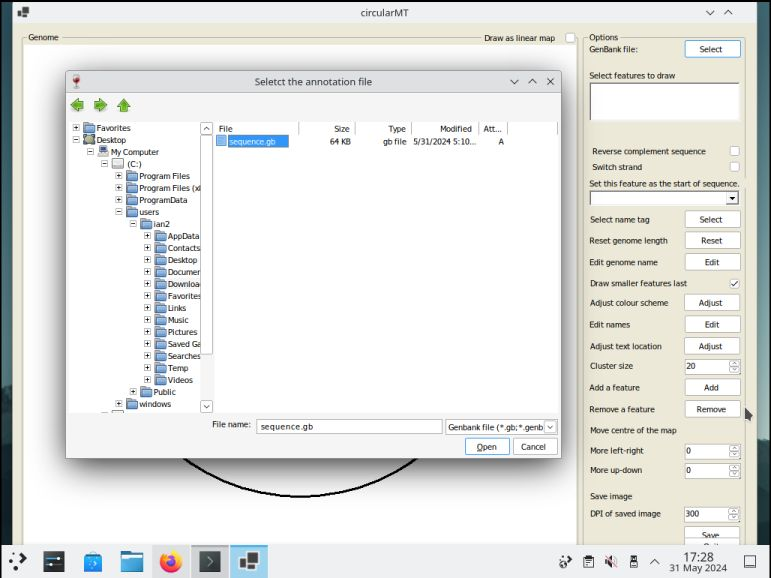
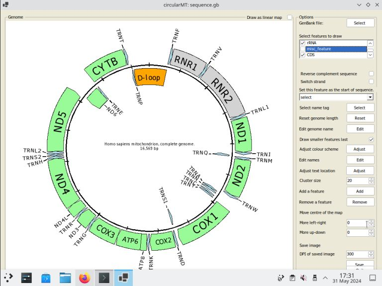

# FreeBSD 
FreeBSD 14.0-RELEASE was installed on a 64 bit virtual machine with 4,096 MB of RAM, 4 processors, 20 GB hard disk. The KDE desktop was installed using the following commands:

> pkg install --quiet --yes kde5 plasma5-sddm-kcm sddm xorg  
> sysrc dbus_enable="YES" && service dbus start  
> sysrc sddm_enable="YES" && service sddm start  

Firefox was then installed with: 

> pkg install www/firefox

The circularMT_64.exe file and the sequence.gb file were downloaded from the GitHub (https://github.com/msjimc/circularMT) 'Program' and 'Example data' folders to the user's Download folder (~/Downloads) using FireFox.

## Preparation and installation

* **The account performing the installation must have admin rights.**

If you have admin rights elevate the terminal to raised privileges with:

> su -l root

and then enter root's password.

The FreeBSD web site contains instructions on how to install Wine [here](https://docs.freebsd.org/en/books/handbook/wine/). It suggest that you first install wine-gecko which contains web browser functions that some programs expect:

>pkg install wine-gecko

Next it suggests installing wine-mono which is needed to run .NET applications:

> pkg install wine-mono

Once these have been installed wine can be installed using:

> pkg install wine

The version of wine can then be determined with:

> wine64 --version

This installation installs wine64 which is the 64 bit version that requires 64 bit programs 

FreeBSD will not run an application from a terminal with root privileges, so return to your normal account with ```Ctrl``` + ```D``` before running circularMT_64.exe with:

> wine64 ~/Downloads/circularMT_64.exe

This should start circular_64.exe after a configuration step that only occurs when wine is run for the first time (Figure 1).

<hr />



Figure 1: circularMT_64.exe running on FreeBSD 14.0-RELEASE with the KDE5 desktop.

<hr />

Once imported, the mitochondrial genome can be modified as described in the [Guide](../Guide/README.md) Figure 2.

<hr />



Figure 2

<hr />