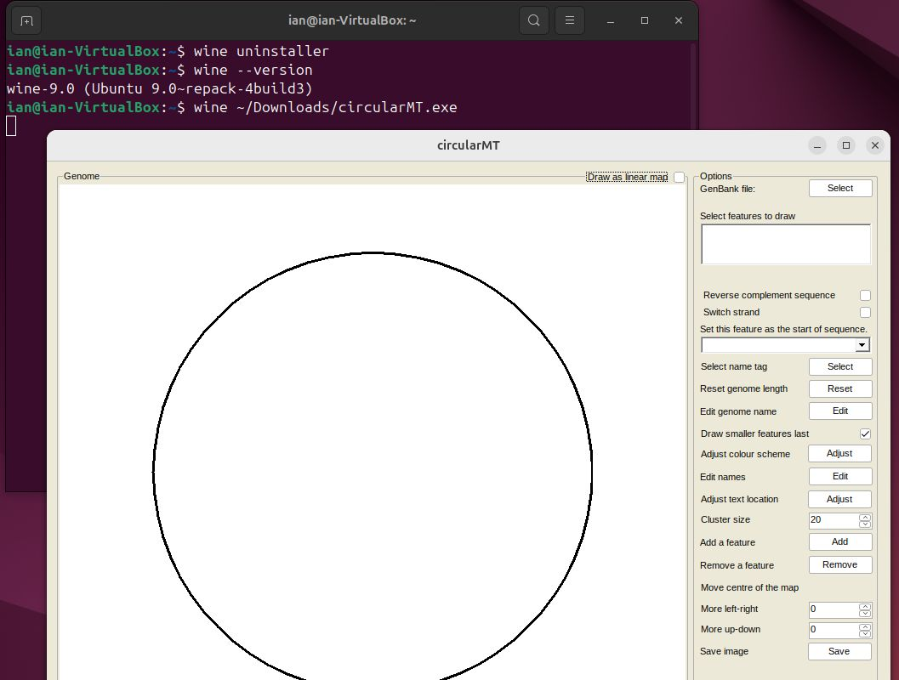
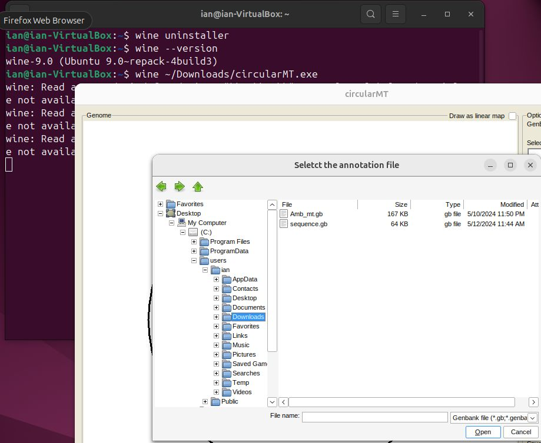
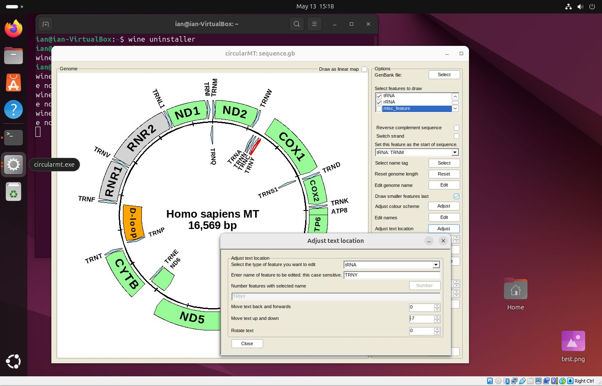
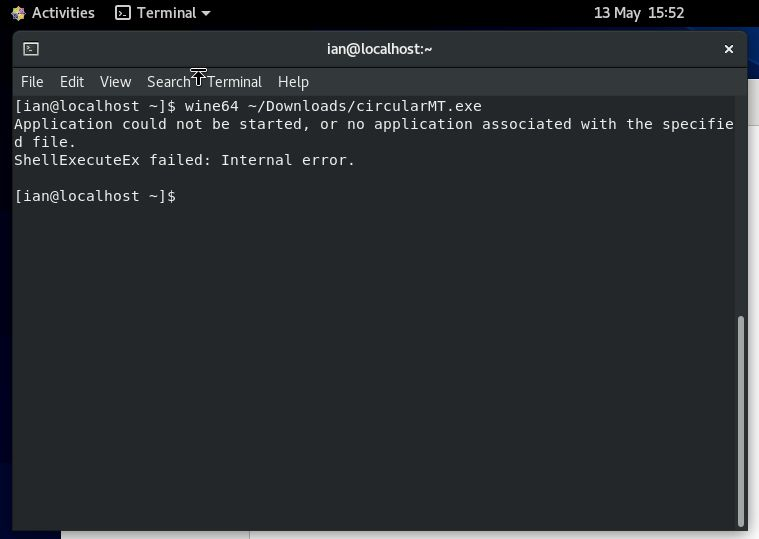

# Running circularMT on a Linux desktop

While circularMT is written in  c#.net and so geared to running on a Windows PC, it is possible to run any Windows application on Linux or macOS using [```Wine```](https://www.winehq.org/). According to Wine's [website](https://www.winehq.org): 
> Wine (originally an acronym for "Wine Is Not an Emulator") is a compatibility layer capable of running Windows applications on several POSIX-compliant operating systems, such as Linux, macOS, & BSD. Instead of simulating internal Windows logic like a virtual machine or emulator, Wine translates Windows API calls into POSIX calls on-the-fly, eliminating the performance and memory penalties of other methods and allowing you to cleanly integrate Windows applications into your desktop.

Basically, ```Wine``` sits in between a Windows application and the operating system and catches any messages they send each other and converts them from what they don't understand to something they do understand, a bit like how an translator allows a German speaker to have a conversation with a Spanish speaker. 

Since ```Wine``` can work on a range of operating systems, how it is installed depends on which flavour of Linux (or macOS) you are using. The ```Wine``` website as instructions for installing ```Wine``` on Ubuntu, Debian, Fedora, macOS, SUSE, Slackware and FreeBSD on their [downloads page](https://wiki.winehq.org/Download). However, unlike installing applications on Windows, the process can be a little demanding for some OS'es. Consequently, below are links to four short guides that show how I installed ```Wine``` on openSUSE, Ubuntu, Debian and Centos via different routes. These guides expect you to have a reasonable understanding of how to install applications on Linux or the whillingness to search online for the solution to any issues.

***Note***: The operating systems used in this guide were installed two different types of virtual machines hosted by by Oracle's VirtualBox on a Windows 10 computer and on Microsoft's Hyper-V on a Windows 11 computer, however, this should not affect how they functioned. The installation was performed on a freshly installed OS.

***Note***: The commands described to install ```Wine``` require admin/superuser rights which may mean that the installation needs to be done by the IT department on a works computer ot that you may be expected to install them in a conda environment. 

# Install guides 

* [openSUSE - 'Leap' 15.5:](openSUSE.md)

* [Ubuntu - 'Noble Numbat' 24.04:](ubuntu.md)

* [Centos - Stream 8](centos_8.md)

* [Debian trixie](debian.md)

## Common issues

#### "wine32" is missing

If you get the message below:

> it looks like wine32 is missing, you should install it.  
as root, please execute "apt-get install wine32"

open the Software & Updates form and select the Security and recommended updates option (Figure 5a), enter your admin password (multiple times), close the form, update/reload if requested and then run the command:

> sudo apt-get install wine32

#### "wine-mono" is missing

If not prompted to do so during the set up you may have to add a wine-mono package to the installation. This can be downloaded from the wine-mono [web page](https://dl.winehq.org/wine/wine-mono/) (https://dl.winehq.org/wine/wine-mono/), for this installation the [wine-mono-9.1.0-x86.msi](https://dl.winehq.org/wine/wine-mono/9.1.0/wine-mono-9.1.0-x86.msi) file was used. To link this file to the ```wine``` installation use the ```wine``` uninstaller by entering:

> wine uninstaller   

in a terminal, pressing the ```Install``` button and selecting the file (Figure 5b).

<hr />


Figure 5a


Figure 5b

<hr />

As with openSUSE, entering 

> wine --version 

demonstrates that the installation has worked, while

> wine ~/Downloads/circularMT.exe 

shows the circularMT interface (Figure 6).

<hr />



Figure 6

<hr />

Pressing the ```Select``` button allows you to import a file, as with openSUSE, the paths displayed by circularMT/Wine are in the Windows format and not the Linux style (Figure 7).

<hr />



Figure 7

<hr />

Once imported, the image of the mitochondrial genome can be modified as described in the [Guide](../Guide/README.md) (Figure 8).

<hr />



Figure 8

<hr />

## Centos stream 8:

Centos Stream 8 was installed on a 64 bit virtual machine with 4,096 MB of RAM, 4 processors and 20 GB hard disk and was configured with default setting. It uses the gnome desktop.

The circularMT_64.exe file and the sequence.gb files were downloaded from the GitHub (https://github.com/msjimc/circularMT) 'Program' and 'Example data' folders to Centos using FireFox (~/Downloads). 

Unlike the installations so far, ```Wine``` was installed on Centos by compiling the source code for ```Wine``` as described by [Sumit Dhattarwal](https://medium.com/@sumitdhattarwal4444/running-windows-applications-and-games-on-centos-rhel-with-wine-9784a53cd8f7) on the web site Medium. An almost identical version was published as few days later [here](https://medium.com/@pateriyadeepali1008/running-windows-apps-and-games-on-centos-rhel-with-wine-c82e9d383603). 

First you need to ensure the dependencies are in place with:

> sudo yum -y groupinstall 'Development Tools'
 
 and then the ```Wine``` source code and additional libraries are downloaded with: 

 > sudo yum install gcc libX11-devel freetype-devel zlib-devel libxcb-devel libxslt-devel libgcrypt-devel libxml2-devel gnutls-devel libpng-devel libjpeg-turbo-devel libtiff-devel dbus-devel fontconfig-devel

The installation is then performed in the /tmp/ temporary folder with:

> cd /tmp  
wget http://dl.winehq.org/wine/source/7.0/wine-7.0.tar.xz  
tar -xvf wine-7.0.tar.xz -C /tmp/  
cd wine-7.0/  
./configure --enable-win64  
make  
sudo make install  

***Note:*** This will install wine 7.0, but you can try and use a newer version if you like.

***Note***: The './configure --enable-win64' step is very slow and maybe best to run overnight. 

Finally, the installation is configured with:

> winecfg

This installation is a 64 bit implementation and so the 64 bit version of circularMT (circularMT_64.exe) should be used using the wine64 command (Figure 9a). If the 32 bit circularMT.exe application is used you will get an error as shown in Figure 9b.

<hr />


Figure 9a



Figure 9b

<hr />

As with the other installations on openSUSE and Ubuntu, circularMT displays the file system in the style of a Windows OS rather than a Linux system (Figure 10).

<hr /> 


Figure 10

<hr />

Once, a genome has been installed, it's map can be modified as shown in the [Guide](../Guide/README.md) (Figure 11).

<hr />


Figure 11

<hr />
