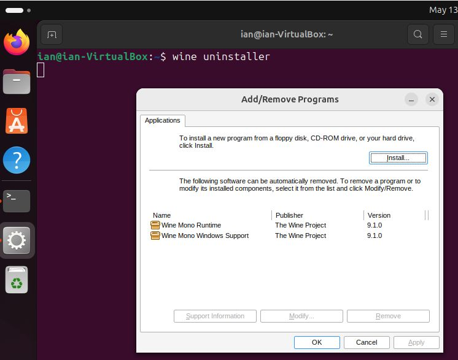

# Running circularMT on a Linux desktop

While circularMT is written in  c#.NET and so geared to running on a Windows PC, it is possible to run any Windows application on Linux or macOS using [```Wine```](https://www.winehq.org/). According to Wine's [website](https://www.winehq.org): 
> Wine (originally an acronym for "Wine Is Not an Emulator") is a compatibility layer capable of running Windows applications on several POSIX-compliant operating systems, such as Linux, macOS, & BSD. Instead of simulating internal Windows logic like a virtual machine or emulator, Wine translates Windows API calls into POSIX calls on-the-fly, eliminating the performance and memory penalties of other methods and allowing you to cleanly integrate Windows applications into your desktop.

Basically, ```Wine``` sits in between a Windows application and the operating system and catches any messages they send each other and converts them from what they don't understand to something they do understand, a bit like how an translator allows a German speaker to have a conversation with a Spanish speaker. 

Since ```Wine``` can work on a range of operating systems, how it is installed depends on which flavour of Linux (or macOS) you are using. The ```Wine``` website as instructions for installing ```Wine``` on Ubuntu, Debian, Fedora, macOS, SUSE, Slackware and FreeBSD on their [downloads page](https://wiki.winehq.org/Download). However, unlike installing applications on Windows, the process can be a little demanding for some OS'es. Consequently, below are links to four short guides that show how I installed ```Wine``` on openSUSE, Ubuntu, Debian and Centos via different routes. These guides expect you to have a reasonable understanding of how to install applications on Linux or the whillingness to search online for the solution to any issues.

***Note***: The operating systems used in this guide were installed two different types of virtual machines hosted by by Oracle's VirtualBox on a Windows 10 computer and on Microsoft's Hyper-V on a Windows 11 computer, however, this should not affect how they functioned. The installation was performed on a freshly installed OS.

***Note***: The commands described to install ```Wine``` require admin/superuser rights which may mean that the installation needs to be done by the IT department on a works computer ot that you may be expected to install them in a conda environment. 

# Install guides 

* [openSUSE - 'Leap' 15.5:](openSUSE.md)

* [Ubuntu - 'Noble Numbat' 24.04:](ubuntu.md)

* [Centos - Stream 8](centos_8.md)

* [Debian trixie](debian.md)

## Common issues

* [wine32 is missing](#wine32-is-missing)
* [wine-mono is missing](#wine-mono-is-missing)

### "wine32" is missing

If you get the message below:

> it looks like wine32 is missing, you should install it.  
as root, please execute "apt-get install wine32"

open the Software & Updates form and select the Security and recommended updates option (Figure 1), enter your admin password (multiple times), close the form, update/reload if requested and then run the command:

> sudo apt-get install wine32

<hr />


Figure 1

<hr />

### "wine-mono" is missing

If not prompted to do so during the set up you may have to add a wine-mono package to the installation. This can be downloaded from the wine-mono [web page](https://dl.winehq.org/wine/wine-mono/) (https://dl.winehq.org/wine/wine-mono/), for this installation the [wine-mono-9.1.0-x86.msi](https://dl.winehq.org/wine/wine-mono/9.1.0/wine-mono-9.1.0-x86.msi) file was used. To link this file to the ```wine``` installation use the ```wine``` uninstaller by entering:

> wine uninstaller   

in a terminal, pressing the ```Install``` button and selecting the file (Figure 5b).

<hr />



Figure 2

<hr />
