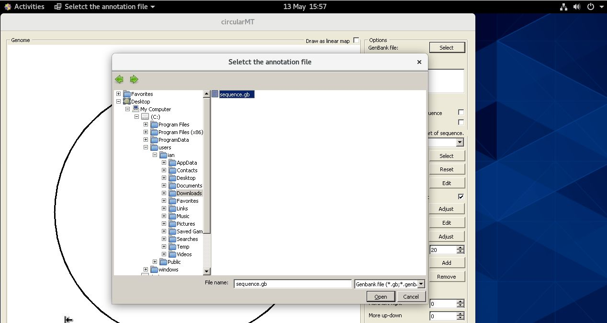
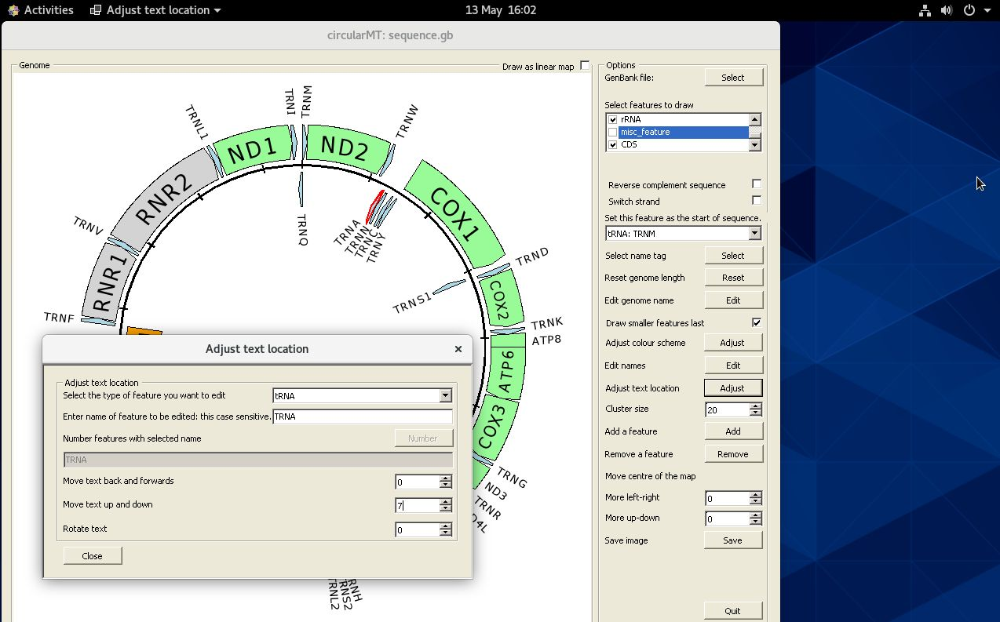

# Centos stream 9:

Centos Stream 9 was installed on a 64 bit virtual machine with 4,096 MB of RAM, 4 processors and 20 GB hard disk and was configured with default settings for a workstation with gnome as the desktop.

The circularMT.exe file and the sequence.gb files were downloaded from the GitHub (https://github.com/msjimc/circularMT) 'Program' and 'Example data' folders to the user's Download folder (~/Downloads) using FireFox. 

## Preparation 

It ius suggested that the computer is updated and rebooted before starting the installation:

> sudo dnf -y update  
> sudo reboot

## Installation

* **The account performing the installation must have admin rights.**

Unlike the installations on openSUSE, Debian and Ubuntu, ```Wine``` was installed on Centos by compiling the source code for ```Wine``` as described by __onlycliches__ on the AlmaLinux forum: [[Script] Compile WINE with 32-Bit App Support](https://forums.almalinux.org/t/script-compile-wine-with-32-bit-app-support/2556). This page contains a script that compiles both the 32 and 64 - bit versions of ```wine```. It appears that things have changed a little since it was written and so needed two extra lines adding.    

> sudo dnf yum install dnf-plugins-core   
sudo yum config-manager --set-enabled crb  

in Cento 8 crb is powertools: 

> sudo dnf yum install dnf-plugins-core   
sudo yum config-manager --set-enabled powertools  


The script can be viewed as containing 3 stages the first downloads the require files and packages and requires user interaction to authorise the downloads, this may take ~5 mins. The next part compiles wine and may take serval hours, but doesn't require user interaction. The final part installs and configures wine and requires you to OK a few steps via dialogue box(es).  

To run the installation script download the install.txt files from [here](https://github.com/msjimc/circularMT/Program) and then run it from a terminal with bash:

> bash install.txt

## Running circularMT

Once installed, download circularMT.exe and the sequence.gb file were downloaded from the GitHub (https://github.com/msjimc/circularMT) 'Program' and 'Example data' folders to our Download folder (~/Downloads) using FireFox and the issue the one of the following commands for 32 - bit or 64 bit programs:

> wine ~/Downloads/circularMT.exe  

or   

> wine64 ~/Downloads/circularMT_64.exe  

If using wine fails with a message regarding loading kernel32.dll, try using wine64 with circularMT_64.exe.


<hr />


Figure 1

<hr />

As with the other installations on openSUSE, Debian and Ubuntu, circularMT displays the file system in the style of a Windows OS rather than a Linux system (Figure 2).

<hr /> 



Figure 2

<hr />

Once, a mitochondrial genome has been imported, it's map can be modified as shown in the [Guide](../Guide/README.md) (Figure 3).

<hr />



Figure 3

<hr />
