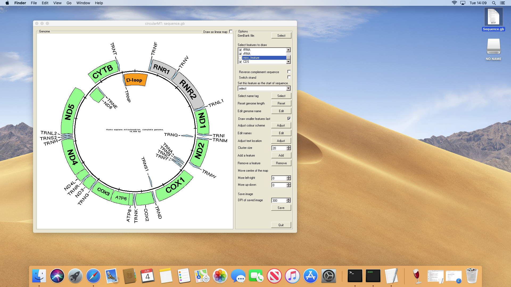

# macOS

Unlike the various Linux installation, macOS can not easily be run on a virtual machine so, WIne was installed on a 2012 macMIni running macOS Mojave 10.14.6. Wine was installed with the aid of XQuarts 2.7.7, by downloading the "Wine Stable" package from [here](https://dl.winehq.org/wine-builds/macosx/download.html) and clicking on the package in the download folder. Newer versions of macOS (macOS Catalina (10.15.4) and later) install Wine using the "brew" application as described [here](https://wiki.winehq.org/MacOS).

Once Wine was installed, circularMT.exe was downloaded and started by clicking on it in the downloads folder. When first used, Wine will run a configuration step which may take a while to run and also download wine-mono and wine-gecko before starting the Windows application (Figure 1). 

Figure 1: circularMT.exe running on masOS (Mojave 10.14.6).

## Install as a package
* https://wiki.winehq.org/MacOS

## Build from source code
* https://wiki.winehq.org/MacOS/Building