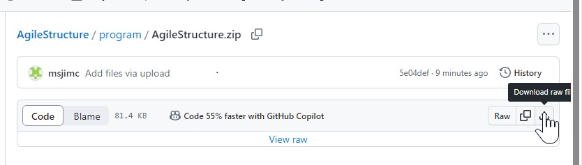
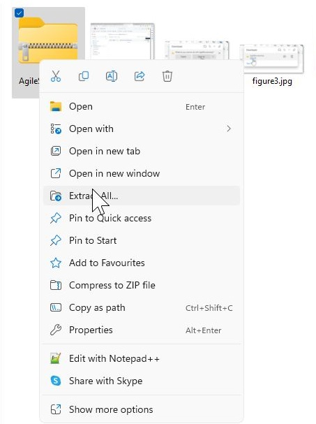
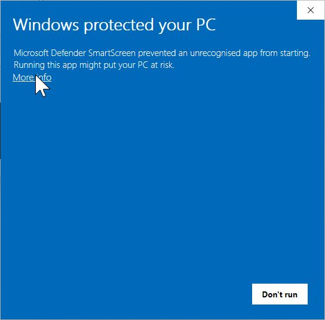
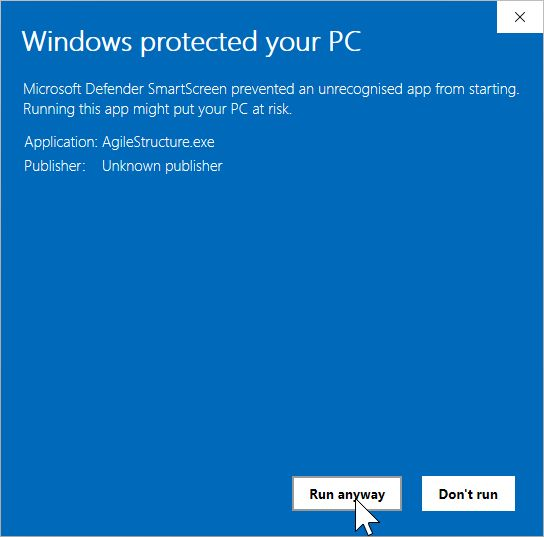
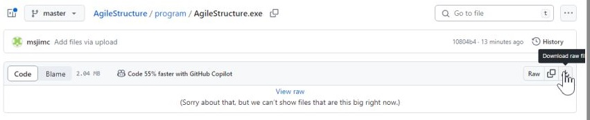
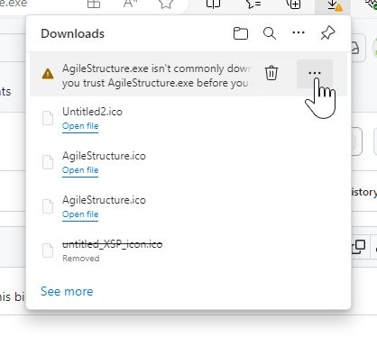
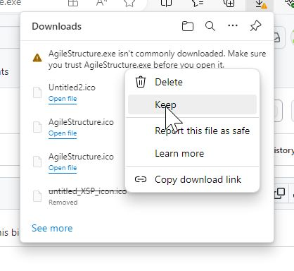
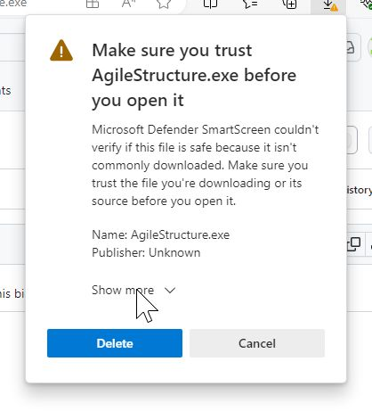
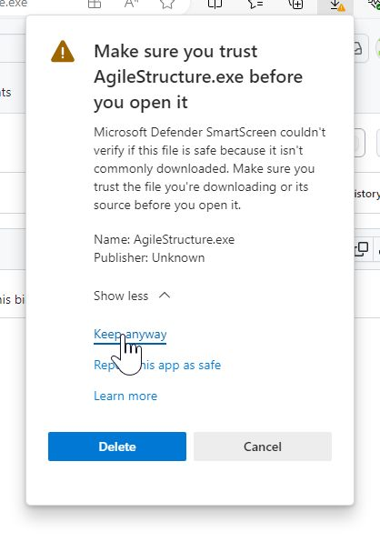
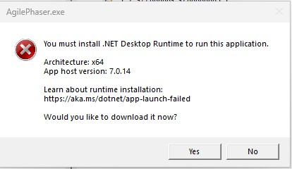

# Download

It is possible to download the whole repository by clicking on the green '<> Code' on the main repository page. This will download the whole repository. If you prefer to just download the program follow steps below:

Download program only

This folder contains the precompiled program, dll and config files as both individual files and a zip file. Due to heightened security by some organisation's IT departments it may not be possible to run a program extracted from a zip file. Consequently, you may have to try downloading the program both ways until one way works. 
 

* [Downloading the zip file](#downloading-the-zip-file)
* [Downloading the executable](#downloading-the-executable)

## Downloading the zip file

First click on the program file (circularMT.zip in the table above) which will take you to a new page, on the upper right hand corner click on the icon of a tray with an arrow pointing to it (Figure 1). This will then start the download which will ultimately prompt you to either save it or open the zip file (Figure 2).

Figure 1

Click on the "Save a"s button (Figure 2)

Figure 2

Once downloaded go to the zip file and extract it, saving the files to the desired location (Figure 3)

Figure 3

When you double click on the circularMT.exe file you'll get a warning message, click on the 'More info' option (Figure 4)

Figure 4

And finally, click on the 'Run  anyway' option and the program should start (Figure 5).

Figure 5

## Downloading the executable

First click on the program file (circularMT.exe in the table above) which will take you to a new page, on the upper righthand corner click on the icon of a tray with an arrow pointing to it (Figure 6). This will then start the download which will ultimately get you to the first warning (Figure 2).

Figure 6

Move the mouse to the right of the message and three dots will appear next to a bin icon (Figure 7), click on the dots.

Figure 7

Next select 'Keep' (Figure 8)

Figure 8

On the next warning, click on the 'Show more' label (Figure 9)

Figure 9

And finally, select the 'Keep anyway' option (Figure 10) and the download will start.

Figure 5

Repeat the process for the circularMT.dll and circularMT.runtimeconfig.json file.

# Running circularMT

To run circularMT double click on the file in File Explorer and it should start. If it doesn't, first make sure that all three files are in the same folder (circularMT.exe, circularMT.dll and circularMT.runtimeconfig.json). If you get an error message such as the one in Figure 6, go to the [.Net download page](https://dotnet.microsoft.com/en-us/download/dotnet/7.0) and select the appropriate ".NET Desktop Runtime". There are a number of options make sure you chose the Desktop version.

Figure 6