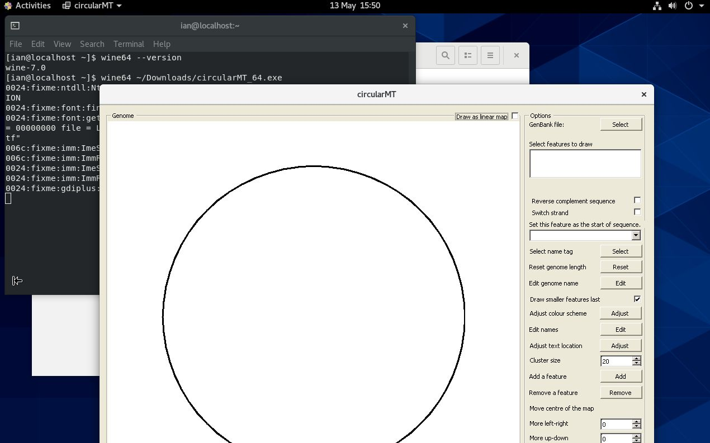
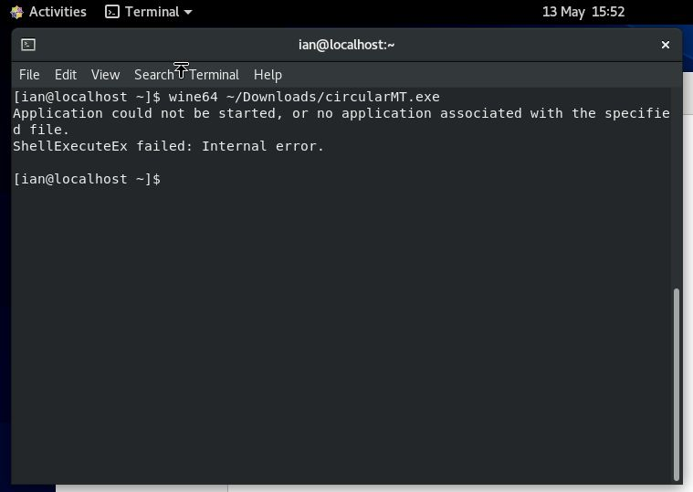
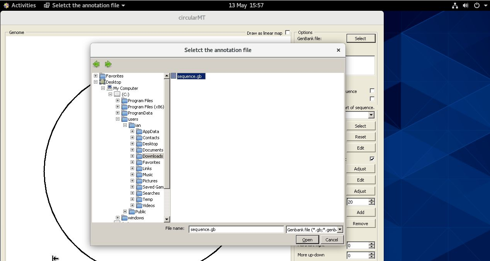

# Centos stream 8:

Centos Stream 8 was installed on a 64 bit virtual machine with 4,096 MB of RAM, 4 processors and 20 GB hard disk and was configured with default settings for a workstation with gnome as the desktop.

The circularMT_64.exe file and the sequence.gb files were downloaded from the GitHub (https://github.com/msjimc/circularMT) 'Program' and 'Example data' folders to the user's Download folder (~/Downloads) using FireFox. 

## Preparation 

It ius suggested that the computer is updated and rebooted before starting the installation:

> sudo dnf -y update  
> sudo reboot

## Installation

* **The account performing the installation must have admin rights.**

Unlike the installations on openSUSE and Ubuntu, ```Wine``` was installed on Centos by compiling the source code for ```Wine``` as described by [Sumit Dhattarwal](https://medium.com/@sumitdhattarwal4444/running-windows-applications-and-games-on-centos-rhel-with-wine-9784a53cd8f7) on the web site Medium. An almost identical version was published as few days later [here](https://medium.com/@pateriyadeepali1008/running-windows-apps-and-games-on-centos-rhel-with-wine-c82e9d383603). 


First you need to ensure the dependencies are in place with:

> sudo yum -y groupinstall 'Development Tools'
 
 and then the ```Wine``` source code and additional libraries are downloaded with: 

 > sudo yum install gcc libX11-devel freetype-devel zlib-devel libxcb-devel libxslt-devel libgcrypt-devel libxml2-devel gnutls-devel libpng-devel libjpeg-turbo-devel libtiff-devel dbus-devel fontconfig-devel

The installation is then performed in the /tmp/ temporary folder with:

> cd /tmp  
wget https://dl.winehq.org/wine/source/9.0/wine-9.0.tar.xz 
tar -xvf wine-9.0.tar.xz -C /tmp/  
cd wine-9.0/  
./configure --without-freetype
./configure --enable-win64  
make  
sudo make install  

***Note:*** This will install wine 7.0, but you can try and use a newer version if you like.

***Note***: The './configure --enable-win64' step is very slow and maybe best to run overnight. 

Finally, the installation is configured with:

> winecfg

This installation is a 64 bit implementation and so the 64 bit version of circularMT (circularMT_64.exe) should be used using the wine64 command (Figure 9a). If the 32 bit circularMT.exe application is used you will get an error as shown in Figure 9b.

<hr />



Figure 9a



Figure 9b

<hr />

As with the other installations on openSUSE and Ubuntu, circularMT displays the file system in the style of a Windows OS rather than a Linux system (Figure 10).

<hr /> 



Figure 10

<hr />

Once, a genome has been installed, it's map can be modified as shown in the [Guide](../Guide/README.md) (Figure 11).

<hr />


Figure 11

<hr />
