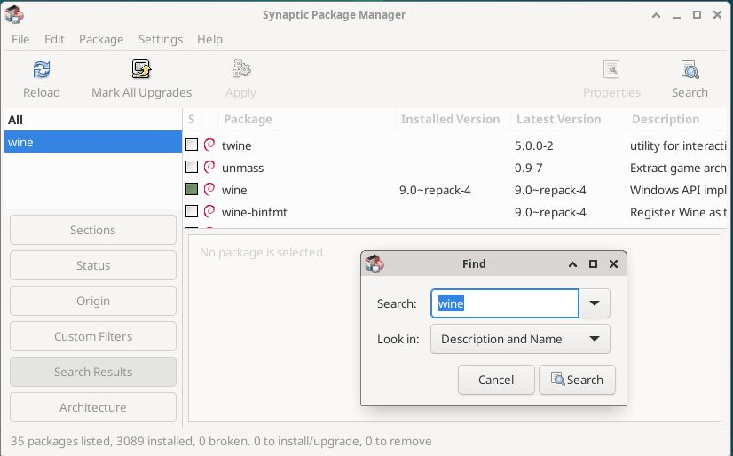

# Debian 
Debian GNU/Linux trixie/sid was installed on a 64 bit virtual machine with 4,096 MB of RAM, 4 processors, 20 GB hard disk and was configured with default settings with the Xfce desktop.

The circularMT.exe file and the sequence.gb file were downloaded from the GitHub (https://github.com/msjimc/circularMT) 'Program' and 'Example data' folders to the user's Download folder (~/Downloads) using FireFox.

## Preparation and installation

* **The account performing the installation must have admin rights.**

The ```Synaptic package Manager``` app was opened and the ```Search``` icon was press to display the ```Find``` dialogue box. After entering the term: ***Wine*** and pressing the ```Search``` button, a list of packages was displayed. Scrolling down the list revealed the wine package.  Clicking on the check box by ***wine*** item displayed the dependencies, while pressing the ```Apply``` button installed ```wine``` and ```wine64``` (Figure 1).

<hr />



Figure 1

<hr />

A terminal was opened and the installation checked (Figure 2) by entering the command

>$  wine --version  
wine-9.0

<hr />


Figure 2

<hr />

The [wine-mono-9.1.0-x86.msi](https://dl.winehq.org/wine/wine-mono/9.1.0/wine-mono-9.1.0-x86.msi) was downloaded from https://dl.winehq.org/wine/wine-mono/9.1.0/ to the user's Download folder and inIn a terminal the following command was entered:

> wine uninstaller

was issued, which displayed the ```Add/remove Programs``` dialogue box (Figure 3). Press the ```Install``` button to select the ***wine-mono-9.1.0-x86.msi*** (Figure 2: note the lower panel will remain blank and will only become populated when reopened). 

<hr />


Figure 3

<hr />

```Wine``` was then used to run circularMT with the following command:

> wine ~/Downloads/circularMT.exe

When first run, ```Wine``` may undergo a configuration step before displaying the circularMT interface (Figure 3).

Once running, data can be imported as described in the [Guide](../Guide/README.md). While circularMT is running on Debian, the file system will appear like a Windows based system rather than a Linux file system (Figure 3). While the user's Download folder is in /home/username/Downloads on Debian it appears to be in c:/users/<username>/Downloads/ to circularMT.

<hr />


Figure 3

<hr />

Once imported, the mitochondrial genome can be modified as described in the [Guide](../Guide/README.md) Figure 4.

<hr />


Figure 4

<hr />

