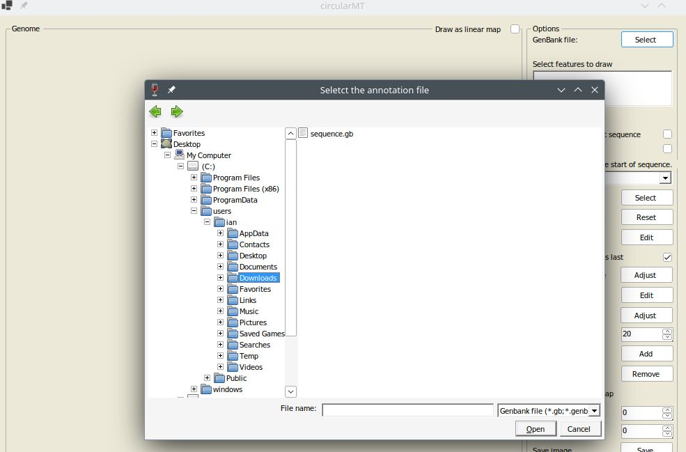

# openSUSE:

## Starting point

OpenSUSE - 'Leap' 15.5 was installed on a 64 bit virtual machine with 4,096 MB of RAM, 4 processors, 20 GB hard disk and was configured with default settings with the KDE desktop.

The circularMT.exe file and the sequence.gb files were downloaded from the GitHub (https://github.com/msjimc/circularMT) 'Program' and 'Example data' folders to openSUSEthe user's Download folder (~/Downloads) using FireFox.

## Preparation

YaST was started from the application launcher and the Software Management option selected. From there ***Wine***, ***wine-32bit***, ***wine-gecko***, ***wine-mono*** and ***winetricks*** were selected and installed (Figure 1). 

<hr />


Figure 1

<hr />

A terminal (```Konsole```) was opened and the installation checked by entering 

>$  wine --version  
wine-8.0

```Wine``` was then used to run circularMT with the following command:

> wine ~/Downloads/circularMT.exe

When first run, ```Wine``` may undergo a configuration step before displaying the circularMT interface (Figure 2).

<hr />


Figure 2

<hr />

Once running, data can be imported as described in the [Guide](../Guide/README.md). While circularMT is running on openSUSE, the file system will appear like a Windows based system rather than a Linux file system (Figure 3). While the user's Download folder is in /home/username/Downloads on openSUSE it appears to be in c:/users/<username>/Downloads/ to circularMT.

<hr />



Figure 3

<hr />

Once imported, the mitochondrial genome can be modified as described in the [Guide](../Guide/README.md) Figure 4.

<hr />


Figure 4

<hr />

