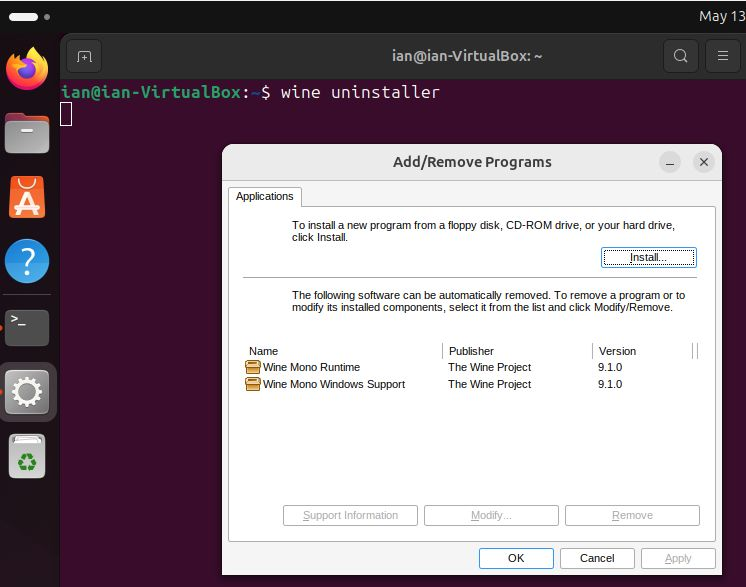
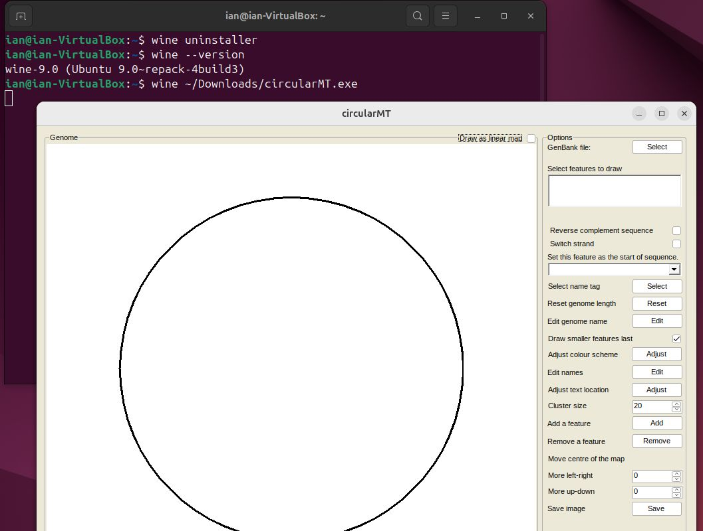
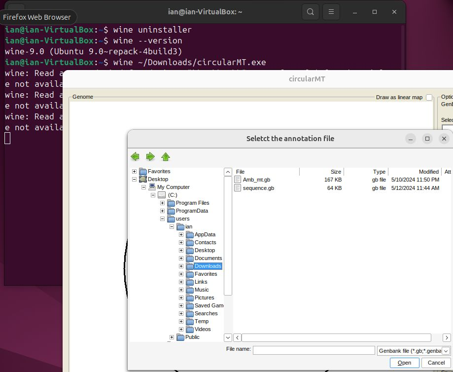
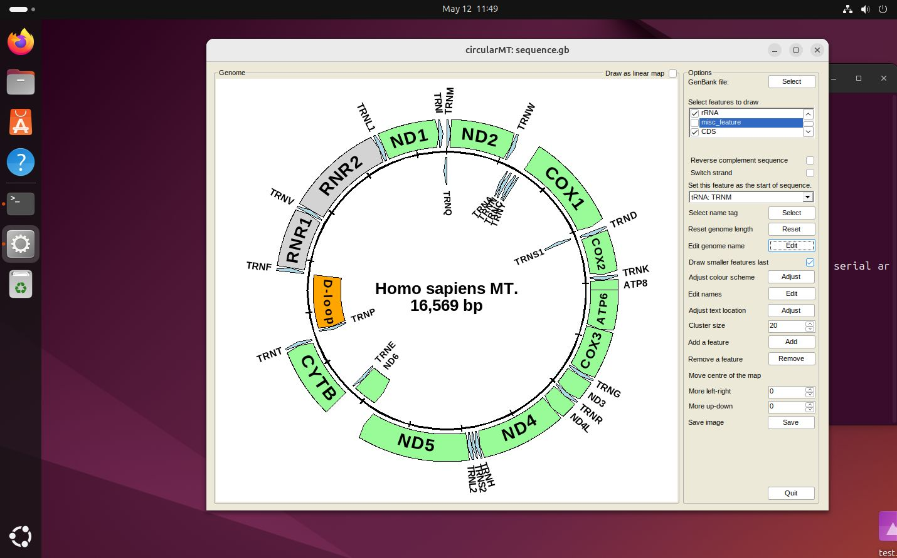

# Ubuntu:

## Starting point
Ubuntu 'Noble Numbat' 24.04 was installed on a 64 bit virtual machine with 4,096 MB of RAM, 4 processors and 25 GB hard disk and was configured with default settings. It uses the gnome desktop.

The circularMT.exe file and the sequence.gb files were downloaded from the GitHub (https://github.com/msjimc/circularMT) 'Program' and 'Example data' folders to the user's Download folder  (~/Downloads) using FireFox. 

## Preparation

### Download the required wine-mono

* wine-mono: Check the wine-mono [web page](https://wiki.winehq.org/Mono) for the required version which can be obtained as a prebuilt files from [here](https://dl.winehq.org/wine/wine-mono/).  Download the *.msi file such that it can be linked to wine after it is installed.

## Installation

```Wine``` was installed on Ubuntu as directed by the Wine [installation guide](https://wiki.winehq.org/Ubuntu).  Initially, the system was prepared for 32 bit applications by entering the following command in a terminal (```Konsole```):

> sudo dpkg --add-architecture i386 

Next the required repositories were added:

> sudo mkdir -pm755 /etc/apt/keyrings  
> sudo wget -O /etc/apt/keyrings/winehq-archive.key https://dl.winehq.org/wine-builds/winehq.key

followed by the required source locations. For Ubuntu Noble Numbat 24.04 the command is (See the ```Wine``` web site for other options):

> sudo wget -NP /etc/apt/sources.list.d/ https://dl.winehq.org/wine-builds/ubuntu/dists/noble/winehq-noble.sources

Finally ```Wine``` was installed using:

> sudo apt install --install-recommends wine-stable

### Issues

***Note***: the documentation currently (May 2024) suggests using the winehq-stable package, but this seems to be a typing error and wine-stable should be used.

### Linking the wine-mono file to wine

Run the following command:

> wine uninstaller

This should open the ```Add/Remove Programs``` window (Figure 1). Press the ```Install``` button and select the wine-mono file and then press ```OK``` to close the form. If you reopen the ```Add/Remove Programs``` window it should now display the ***Wine Mono Runtime*** and ***Wine Mono Windows Support*** in the lower panel (Figure 1).

<hr />



Figure 1

<hr />

## Check the installation

Run the following command:

> wine --version  

This should tell you what version of wine you have, if you also get a message that wine32 is missing see the next section other wise go to the 

#### wine32 is missing

If you get a message like:

> it looks like wine32 is missing, you should install it.  
as root, please execute "apt-get install wine32"


***Note***: if your message mentions wine32:i386 or similar, ignore the text after the the ":" and run the same command as below.

open the ```Software and Updates``` app and changes the ***Subscribe to:*** option to ***Security and recommended updates***, then enter your (admin) password several times and reload the information as requested (Figure 2).  

<hr />


Figure 2

<hr />

Once the option has been changed run:

> sudo apt-get install wine32

Once installed you can change the ***Subscribe to:*** option back to its original value.

 ## Running circularMT.exe

 To run ```circularMT``` issue the command below:

> wine ~/Downloads/circularMT.exe 

The first time it runs you may have to wait will wine runs a configuration script. If this displays a dialogue window in German click the left hand button to accept. If all as gone well circularMT show appear as shown in Figure 3.

<hr />



Figure 3

<hr />

Pressing the ```Select``` button allows you to import a file, as with openSUSE, the paths displayed by circularMT/Wine are in the Windows format and not the Linux style (Figure 4).

<hr />



Figure 4

<hr />

Once imported, the image of the mitochondrial genome can be modified as described in the [Guide](../Guide/README.md) (Figure 5).

<hr />



Figure 5

<hr />
