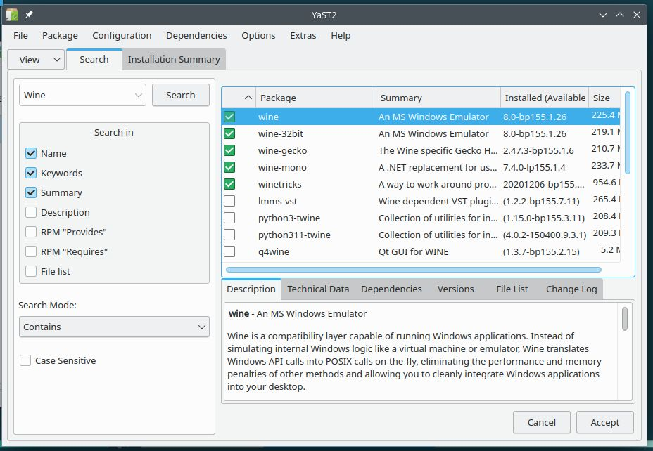
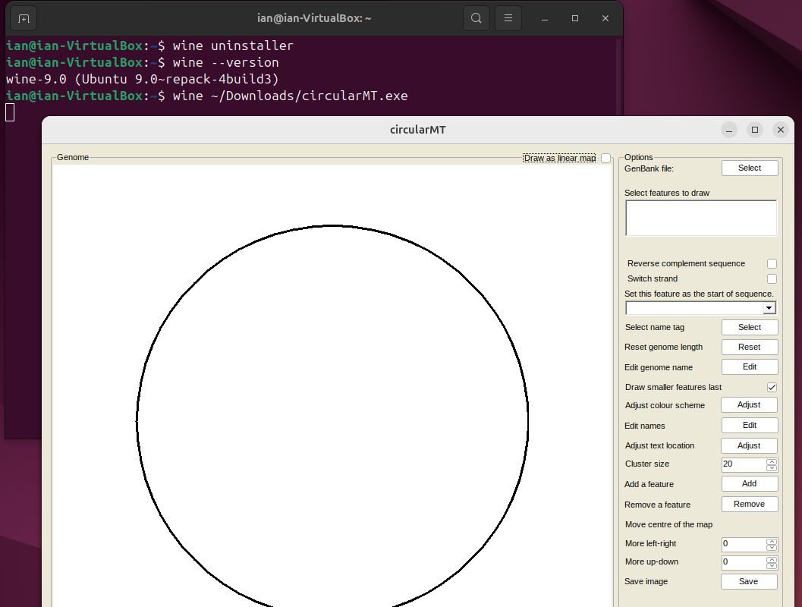
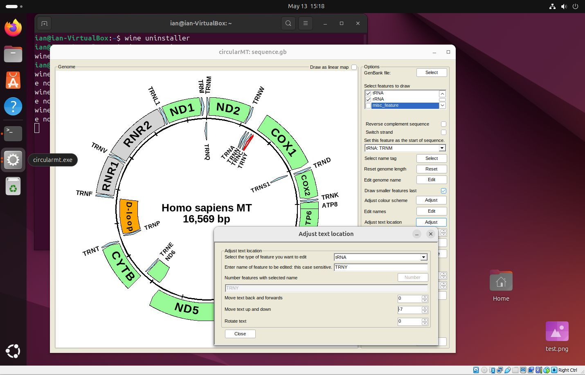

# Running circularMT on a Linux desktop

While circularMT is written in  c#.net and so geared to running on a Windows PC, it is possible to run any Windows application on Linux or macOS using [```Wine```](https://www.winehq.org/). According to their website: 
> Wine (originally an acronym for "Wine Is Not an Emulator") is a compatibility layer capable of running Windows applications on several POSIX-compliant operating systems, such as Linux, macOS, & BSD. Instead of simulating internal Windows logic like a virtual machine or emulator, Wine translates Windows API calls into POSIX calls on-the-fly, eliminating the performance and memory penalties of other methods and allowing you to cleanly integrate Windows applications into your desktop.

Basically, ```Wine``` sits in between a Windows application and the operating system and catches any messages they send each other and converts them from what they don't understand to something they do understand, a bit like how an translator allows a German speaker to have a conversation with a Spanish speaker. 

Since ```Wine``` can work on a range of operating systems how it is installed depends on which flavour of Linux (or macOS) you are using. The ```Wine``` website as instructions for installing ```Wine``` on Ubuntu, Debian, Fedora, macOS, SUSE, Slackware and FreeBSD on their [downloads page](https://wiki.winehq.org/Download). However, unlike installing applications on Windows, the process can be a little demanding for some OS'es. Consequently, below are three short guides that allowed me to install ```Wine``` on openSUSE, Ubuntu and Centos via different routes. These guides expect you to have a more than passing understanding of how to install applications on Linux.

***Note***: The operating systems used in this guide were installed via Oracle's VirtualBox as virtual machines, however, this should not affect how they functioned.

***Note***: The commands described to install ```Wine``` require admin/superuser rights which may mean that the installation needs to be done by the IT department on a works computer ot that you may be expected to install them in a conda environment. 

## openSUSE:
OpenSUSE - 'Leap' 15.5 was installed on a 64 bit virtual machine with 4,096 MB of RAM, 4 processors, 20 GB hard disk and was configured with default setting with the using the KDE desktop.

The circularMT.exe file and the sequence.gb files were downloaded from the GitHub (https://github.com/msjimc/circularMT) 'Program' and 'Example data' folders to openSUSE using FireFox (~/Downloads).

YaST was started from the application launcher and the Software Management option selected. From there ***Wine***, ***wine-32bit***, ***wine-gecko***, ***wine-mono*** and ***winetricks*** were selected and installed (Figure 1). 

<hr />



Figure 1

<hr />

A terminal (```Konsole```) was opened and the installation checked by entering 

>$  wine --version  
wine-8.0

```Wine``` was then used to run circularMT with the following command:

> wine ~/Downloads/circularMT.exe

When first run, ```Wine``` may undergo a configuration step before displaying the circularMT interface (Figure 2).

<hr />


Figure 2

<hr />

Once running, data can be imported as described in the [Guide](../Guide/README.md). While circularMT is running on openSUSE, the file system will appear like a Windows based system rather than a Linux file system (Figure 3). While the user's Download folder is in /home/username/Downloads on openSUSE it appears to be in c:/users/<username>/Downloads/ to circularMT.

<hr />


Figure 3

<hr />

Once imported, the mitochondrial genome can be modified as described in the [Guide](../Guide/README.md) Figure 4.

<hr />


Figure 4

<hr />


## Ubuntu:

Ubuntu 'Noble Numbat' 24.04 was installed on a 64 bit virtual machine with 4,096 MB of RAM, 4 processors and 25 GB hard disk and was configured with default setting. It uses the gnome desktop.

The circularMT.exe file and the sequence.gb files were downloaded from the GitHub (https://github.com/msjimc/circularMT) 'Program' and 'Example data' folders to Ubuntu using FireFox (~/Downloads). 

Unlike OpenSUSE, ```Wine``` was installed on Ubuntu as directed by the Wine [installation guide](https://wiki.winehq.org/Ubuntu).  Initially, the system was prepared for 32 bit applications by entering the following command in a terminal (```Konsole```):

> sudo dpkg --add-architecture i386 

Next the required repositories were added:

> sudo mkdir -pm755 /etc/apt/keyrings  
> sudo wget -O /etc/apt/keyrings/winehq-archive.key https://dl.winehq.org/wine-builds/winehq.key

followed by the required source locations. For Ubuntu Noble Numbat 24.04 the command is (See the ```Wine``` web site for other options):

> sudo wget -NP /etc/apt/sources.list.d/ https://dl.winehq.org/wine-builds/ubuntu/dists/noble/winehq-noble.sources

Finally ```Wine``` was installed using:

> sudo apt install --install-recommends wine-stable

***Note***: the documentation currently (May 2024) suggests using the winehq-stable package, but this seems to be a typing error and wine-stable should be used.

If not prompted to do so during the set up you may have to add a wine-mono package to the installation. This can be downloaded from the wine-mono [web page](https://dl.winehq.org/wine/wine-mono/) (https://dl.winehq.org/wine/wine-mono/), for this installation the [wine-mono-9.1.0-x86.msi](https://dl.winehq.org/wine/wine-mono/9.1.0/wine-mono-9.1.0-x86.msi) file was used. To link this file to the ```wine``` installation use the ```wine``` uninstaller by entering:

> wine uninstaller   

in a terminal, pressing the ```Install``` button and selecting the file (Figure 5).

<hr />


Figure 5

<hr />

As with openSUSE, entering 

> wine --version 

demonstrates that the installation has worked, while

> wine ~/Downloads/circularMT.exe 

shows the circularMT interface (Figure 6).

<hr />



Figure 6

<hr />

Pressing the ```Select``` button allows you to import a file, as with openSUSE, the paths displayed by circularMT/Wine are in the Windows format and not the Linux style (Figure 7).

<hr />


Figure 7

<hr />

Once imported, the image of the mitochondrial genome can be modified as described in the [Guide](../Guide/README.md) (Figure 8).

<hr />



Figure 8

<hr />

## Centos stream 8:

Centos Stream 8 was installed on a 64 bit virtual machine with 4,096 MB of RAM, 4 processors and 20 GB hard disk and was configured with default setting. It uses the gnome desktop.

The circularMT_64.exe file and the sequence.gb files were downloaded from the GitHub (https://github.com/msjimc/circularMT) 'Program' and 'Example data' folders to Centos using FireFox (~/Downloads). 

Unlike the installations so far, ```Wine``` was installed on Centos by compiling the source code for ```Wine``` as described by [Sumit Dhattarwal](https://medium.com/@sumitdhattarwal4444/running-windows-applications-and-games-on-centos-rhel-with-wine-9784a53cd8f7) on the web site Medium. An almost identical version was published as few days later [here](https://medium.com/@pateriyadeepali1008/running-windows-apps-and-games-on-centos-rhel-with-wine-c82e9d383603). 

First you need to ensure the dependencies are in place with:

> sudo yum -y groupinstall 'Development Tools'
 
 and then the ```Wine``` source code and additional libraries are downloaded with: 

 > sudo yum install gcc libX11-devel freetype-devel zlib-devel libxcb-devel libxslt-devel libgcrypt-devel libxml2-devel gnutls-devel libpng-devel libjpeg-turbo-devel libtiff-devel dbus-devel fontconfig-devel

The installation is then performed in the /tmp/ temporary folder with:

> cd /tmp  
wget http://dl.winehq.org/wine/source/7.0/wine-7.0.tar.xz  
tar -xvf wine-7.0.tar.xz -C /tmp/  
cd wine-7.0/  
./configure --enable-win64  
make  
sudo make install  

***Note:*** This will install wine 7.0, but you can try and use a newer version if you like.

***Note***: The './configure --enable-win64' step is very slow and maybe best to run overnight. 

Finally, the installation is configured with:

> winecfg

This installation is a 64 bit implementation and so the 64 bit version of circularMT (circularMT_64.exe) should be used using the wine64 command (Figure 9a). If the 32 bit circularMT.exe application is used you will get an error as shown in Figure 9b.

<hr />


Figure 9a


Figure 9b

<hr />

As with the other installations on openSUSE and Ubuntu, circularMT displays the file system in the style of a Windows OS rather than a Linux system (Figure 10).

<hr /> 


Figure 10

<hr />

Once, a genome has been installed, it's map can be modified as shown in the [Guide](../Guide/README.md) (Figure 11).

<hr />


Figure 11

<hr />
