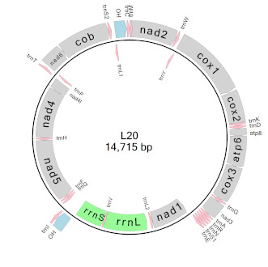

# circularMT

## Contents

- [Introduction](#Introduction)
- [Guide](guide)
- [Download](program)

## Introduction



circularMT is designed to create images of the genomic structure of mitochodrial genomes that can be used to display the arrangement of the genes they encode. Images can be exported as 300 dpi tif files for use in reports, papers or a thesis.

The data can be imported from a wide range of file formats such as *.fasta, *.mitos, *.gb, *.bed, *.seq, *.gtf and *.gff files. While ```circularMT``` can process these files, *.fasta and *.bed files in particular  most conform to a set format.

Onces imported the image can be rotated, the strands switched around and  the features renamed, deleted and colour scheme changed to obtain the desired map.

## Guide


## Download


