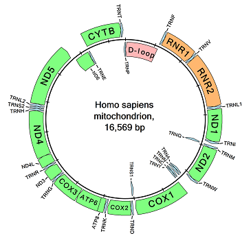

# circularMT

## Contents

- [Introduction](#Introduction)
- [Guide](#guide)
- [Download](#download)

## Introduction



```circularMT``` is designed to create images of the genomic organisation of mitochondrial genomes that can be used to display the arrangement of the genes they encode. Images can be exported as 300 dpi TIFF, bitmap, PNG or JPEG files for use in reports, publications or a thesis. The maps can be circular like the one to the right or linear like the one below.

The data can be imported from a wide range of file formats such as *.fasta, *.mitos, *.gb, *.bed, *.seq, *.gtf and *.gff files. While ```circularMT``` can process these files, *.fasta and *.bed files in particular most conform to a set format not present in all files.

Onces imported the resultant image can be rotated, the strands switched around and the features renamed, deleted and colour scheme changed to obtain the desired map.

<center></center>

## Guide

The user guide is [here](Guide/README.md).

## Download

The prebuilt program can be downloaded [here](Program/README.md).

