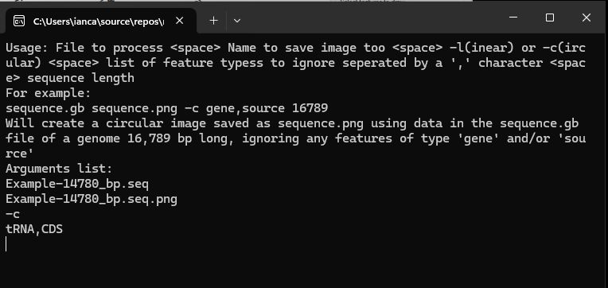
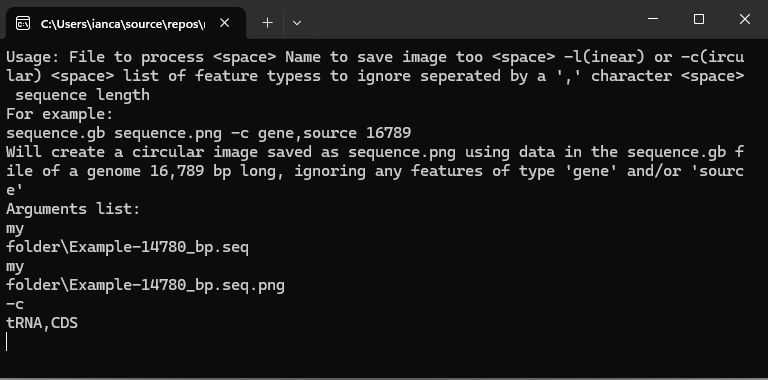

# ````circularMT-console````

## Circular or linear maps

```circularMT-console``` was created to display the organisation of circular mitochondrion genomes, principally from metazoan eukaryotes. While these genomes are circular it is possible to display them as either circular or linear maps. 

### File formats 
```circularMT-console``` is able to read a range of file formats such as Genbank, mitos, seq, bed, fasta, gtf and gff files. A description of the required formatting of each of these files can be found in the ```circularMT``` section [here](../../Guide/FileFormats.md).

## Running circularMT-console

```circularMT-console``` is written in .Net language c# and so runs natively on Windows based computers, however, it can also be run on Linux based systems via the compatibility layer application [Wine](https://www.winehq.org/) as described in the [Linux with Wine](../Linux_with_Wine/README.md) guide.

## Command line arguments

***Windows command format:***

> circularMT-console.exe "Data file" "export image file" "image type" "feature types to exclude" "sequence length"

***Linux command format:*** 

> wine circularMT-console.exe "Data file" "export image file" "image type" "feature types to exclude" "sequence length"

***Note:*** The command line arguments to run ```circularMT-console``` on a Linux computer are the same as those used on a Windows computer except the command in Linux is prefixed by the word ```wine```.

|Argument|Description|
|-|-|
|wine|This required for Linux and macOS computers and should not be used for Windows computers. ```Wine``` must be installed on the computer.|
|circularMT-console.exe|The file name with path of the circularMT-console application. circularMT-console.exe is a 32-bit application which should also work on 64 bit OS's. circularMT-console_64.exe is a 64-bit programme which can only run on 64-bit OS's
|data file| The data file's name with path. This can be a: <br />  Genbank file (\*.__genbank__, \*.__gb__), <br /> Mitos file (\*.__mitos__), <br /> GTF or GFF annotation file (\*.__gff__, \*.__gtf__). <br /> Suitably formatted - <br /> bed file (\*.__bed__), <br /> fasta file (DNA) (\*.__fasta__, \*.__fas__, \*.__fa__), <br /> seq file (\*.__seq__).|
|export image file| Name with path of the file to save the image too. <br /> Permissable file types are: <br /> Bitmaps (\*.__bmp__), <br /> Portable Network Graphics (\*.__png__), <br /> Joint Photographic Experts Group (\*.__jpg__, \*.__jpeg__) and <br /> Tag Image File Format (*.__tiff__) files.|
|image type| Determines if image is circular (-c) or linear (-l)|
|List of features to ignore|The same transcribed sequence may be annotated as number of different types of features which may lead to each feature been drawn multiple times. For example when processing a genbank file you may wish to ignore ***gene*** features (by entering ***gene***) as they duplicate ***tRNA***, ***rRNA*** and ***CDS*** features. If you wished to show the ***gene*** features and not ***tRNA***, ***rRNA*** or ***CDS*** features: enter "tRNA,rRNA,CDS". If you want to show all feature types enter ***All***.|
|Sequence length|Not all file types contain the whole genomic sequence or reference it's length, consequently to draw the map you must enter the genome's length.|

## Errors

If you enter the wrong number of arguments, an error message will be displayed that explains the structure of the command and then lists the arguments it received (Figure 1)



Figure 1: The length of the sequences was omitted from the command line arguments.

<hr />

If a file name or folder in the file's path contains a space (i.e. My Documents), the file + path argument will be broken up at each space. This is spotted as the wrong number of arguments as shown in Figure 2 where the files are in a folder called __My folder__ causing the data and image filenames to be split in to two parts. To submit a name containing a space put the whole filename and path in speech marks as shown below:


### Error
***C:\user\ian\My documents\data.mitos***   
will appear two arguments:   
***C:\user\ian\My*** and ***documents\data.mitos*** 

### Correct
***"C:\user\ian\My documents\data.mitos"***   
will be passed as one argument:   
***C:\user\ian\My documents\data.mitos*** 



Figure 2: A folder's name (My folder) contains a space which caused the path to be split in to two arguments. The command is also missing the sequence length information.

<hr />